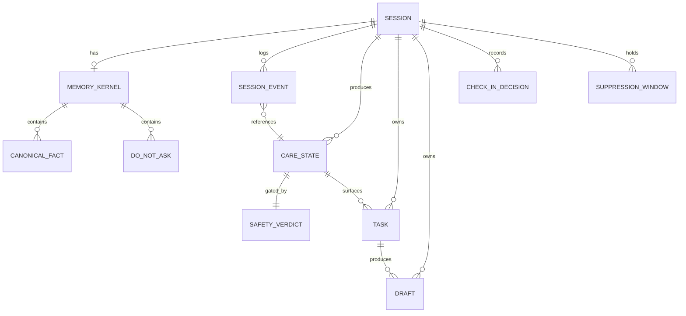
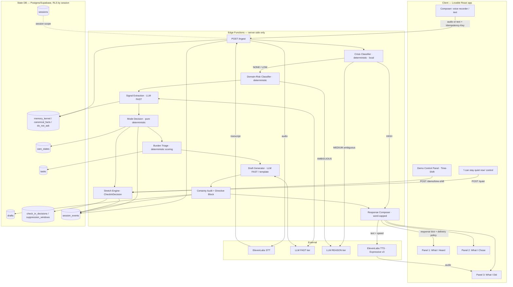
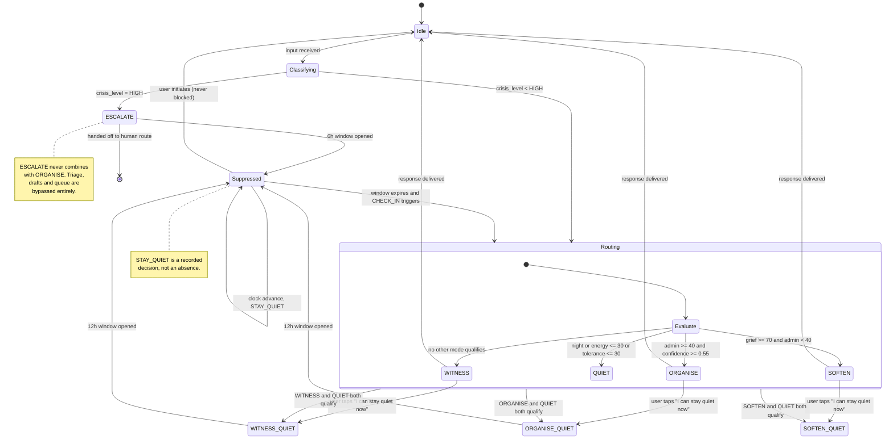

# QuietBridge — Software Requirements Specification (SRS) / Technical PRD

---

## 0. Document Control

| Field | Value |
|---|---|
| Document ID | QB-SRS-001 |
| Title | QuietBridge Software Requirements Specification |
| Version | 0.1 (Pass 1 draft) |
| Status | DRAFT — for internal review (Pass 2 pending) |
| Date | 2026-07-30 |
| Author | Principal Requirements Engineer / AI Systems Architect |
| Source documents | `docs/IDEA.md` (product brief, §5 agent instructions), `docs/deep-research-report.md` (positioning + demo plan) |
| Target build window | One evening (hackathon), Track 1 — Presence |
| Target stack | Lovable (full-stack web), ElevenLabs (voice I/O), LLM provider via cost-tiered routing |
| Judged on | Originality, Technical Execution, Applicability, Fit to Brief — equally weighted, judged live |

### 0.1 Revision History

| Ver | Date | Change | Author |
|---|---|---|---|
| 0.1 | 2026-07-30 | Initial full draft (Pass 1). All sections populated. Assumptions marked `[ASM-nnn]`. | Architect |
| 0.2 | 2026-07-30 | Added §5.13 Adaptive Presentation (`FR-ADAPT`): entry mode choice, four-mood taxonomy, mood-driven theming, optional age register. Facial-emotion capture evaluated and rejected — see `OOS-12`, `RISK-015`. | Architect |
| 0.3 | 2026-07-30 | Mood is now **user-declared** rather than inferred (§2.7, §5.13.2a). Inference demoted to `C`, may offer but never override. Camera retained as a pitch-roadmap item under explicit honesty rules (`FR-ADAPT-026`–`028`). | Architect |

### 0.2 Requirement ID Convention

`FR-<AREA>-<NNN>` for functional, `NFR-<AREA>-<NNN>` for non-functional, `ASM-<NNN>` for assumptions, `CON-<NNN>` for constraints, `RISK-<NNN>` for risks, `AC-<AREA>-<NNN>` for acceptance criteria.

Areas: `IN` (ingestion), `ROUTER`, `MEM` (memory kernel), `STRETCH`, `TRIAGE`, `QUEUE` (Not Tonight), `DRAFT`, `SAFE` (safety/guardrails), `UI`, `ADAPT` (adaptive presentation), `QUIET`, `DEMO`, `API`, `VOICE`, `OBS` (observability), `SEC`, `PRIV`, `A11Y`, `PERF`, `COST`, `REL`.

Priority: **M** = must (demo fails without it), **S** = should (demo is weaker without it), **C** = could (stretch if time remains).

Verification method: **T** = automated test, **D** = demonstration, **I** = inspection of artefact/code, **A** = analysis/measurement.

Every requirement below carries `[Priority | Verification]`.

---

## 1. Introduction

### 1.1 Purpose

This SRS specifies QuietBridge: an empathetic **care-routing agent** that sits as a front-door buffer between a person in acute grief/overload and the systems demanding things from them. It defines the functional behaviour, data contracts, APIs, UI, model routing, and quality attributes required to build and live-demo the system within a single hackathon evening.

The central product thesis, which every requirement must serve:

> **Empathy is not primarily what you say. It is how you decide what kind of help to give, and how much.**

QuietBridge makes **silence, burden triage, and escalation first-class actions** rather than response-styling.

### 1.2 Intended Audience

- Build team (Lovable prompt authors, prompt/model engineers, voice integrator).
- Demo presenter (needs §12 traceability + §13 scenarios).
- Judges/reviewers (needs §1–§3, §5, §12).

### 1.3 Product Perspective

QuietBridge is a **greenfield, self-contained web application**. It does not integrate with EverSettled production systems, does not touch real government or bank APIs, and does not replicate probate workflow software. It is adjacent to EverSettled's mission (post-death estate settlement) as a *front door*, not a competitor to its `Sage` assistant.

### 1.4 Definitions, Acronyms, Glossary

| Term | Definition |
|---|---|
| **Care State** | A structured JSON decision object — not a chat reply — describing the mode(s) selected, the contextual signals, the rationale, and the delivery policy. The system's primary output. |
| **Mode** | One of `WITNESS`, `ORGANISE`, `QUIET`, `SOFTEN`, `ESCALATE`. Modes may combine (see §5.2.4). |
| **WITNESS** | Low-pressure acknowledgement. Zero follow-up questions, no task surfacing. |
| **ORGANISE** | High admin burden detected. Extract exactly one immediate action, produce drafts, queue the rest. |
| **QUIET** | Minimal UI, minimal or no speech, silence-first. A delivery-shaping mode. |
| **SOFTEN** | Emotional holding without action items and without advice. |
| **ESCALATE** | Crisis signal detected. Bypass normal flow, surface urgent help routes. |
| **Memory Kernel** | The persistent store of canonical facts and stated preferences about the user's situation. |
| **Canonical Fact** | An atomic, deduplicated, source-attributed statement about the user's situation (e.g. `deceased.relation = "mother"`). |
| **Don't-ask-again** | A user preference marking a topic as settled; the system must never re-request it. |
| **The Stretch** | The multi-day presence model spanning Day 1 → Day 4 → Day 14 of the bereavement period. |
| **Check-in Decision** | The explicit, logged decision to either proactively contact the user or deliberately stay silent, with rationale. |
| **Suppression Window** | A time interval during which no proactive contact may occur. |
| **Single Next Step** | The one highest-priority, lowest-friction action surfaced to the user at any moment. Cardinality is exactly 1. |
| **Not Tonight queue** | The deferred, visually de-emphasised secondary task list. |
| **Smart Draft** | A generated artefact the user can send/use: work message, bank call script, Tell Us Once prep, DNS prep. |
| **Certainty Audit** | A guardrail pass that strips or hedges unwarranted certainty, especially in legal/financial domains. |
| **Tell Us Once (TUO)** | UK government service to report a death to most government organisations in one interaction. |
| **Death Notification Service (DNS)** | UK service to notify multiple participating financial institutions of a death at once. |
| **Time-Shift** | The demo control that moves the simulated clock across Day 1 / Day 4 / Day 14. |
| **Energy Score** | 0–100 estimate of the user's available cognitive capacity. Inverse of fatigue. |
| **Admin Density** | 0–100 estimate of how many distinct bureaucratic demands are present in the input + backlog. |
| **Burden Conversion** | Turning one narrative into multiple context-appropriate practical outputs. |

### 1.5 References

- UK **Tell Us Once** service; UK **Death Notification Service** — used as the grounded targets of the Not Tonight queue.
- **NHS 111** (urgent mental-health route), **999 / A&E** (immediate danger), **Samaritans 116 123** (confidential listening) — the three UK crisis routes.
- NHS grief guidance: do not do everything at once; set small achievable targets.
- DWP Digital content guidance on death: clear, succinct, no euphemism.
- ElevenLabs: Expressive Conversational (v3), speed range **0.7–1.2**, natural conversation ~0.9–1.1x, slower pacing for complex topics.
- Lovable: full-stack app generation, first deploy in ~10 minutes.
- EverSettled terms: explicitly not legal/financial/tax/healthcare/insurance/real-estate advice — QuietBridge mirrors this posture.

---

## 2. Scope

### 2.1 In Scope

1. Single-user, single-session-thread web application, one scenario done extremely well: **a death-related moment of administrative overload**.
2. Voice note **and** text input ingestion.
3. Deterministic-first Care-State Router with visible rationale.
4. Memory kernel with canonical facts + don't-ask-again preferences.
5. The Stretch engine with Day 1 / Day 4 / Day 14 states and check-in-vs-stay-quiet logic.
6. Burden triage → exactly one next step; Not Tonight queue.
7. Smart drafts: work message, bank call script, TUO prep, DNS prep.
8. Safety guardrails: legal/financial non-advice posture, certainty audit, UK crisis escalation.
9. Three-panel UI (What I Heard / What I Chose / What I Did), the "I can stay quiet now" control.
10. Demo Time-Shift control panel.
11. ElevenLabs spoken output with mode-dependent pacing.
12. Event log sufficient to prove the system's decisions on stage.

### 2.2 Out of Scope

| ID | Out of scope | Rationale |
|---|---|---|
| OOS-01 | Real probate/estate workflow execution, document vault, executor task management | Duplicates EverSettled; not demoable value |
| OOS-02 | Actual submission to Tell Us Once / DNS / any government or bank system | No real integrations; prep artefacts only |
| OOS-03 | Actual sending of email/SMS to third parties | Drafts are copy-to-clipboard only |
| OOS-04 | Multi-user accounts, family coordination, roles, sharing | Out of hackathon budget |
| OOS-05 | Real PII of any kind; production identity/auth; GDPR data-subject workflows | Synthetic data only (`CON-003`) |
| OOS-06 | Native mobile apps | Responsive web only |
| OOS-07 | Clinical assessment, diagnosis, therapy, or risk scoring of the user as a patient | Explicitly disclaimed posture |
| OOS-08 | Multi-language / non-UK jurisdictions | UK-only crisis + admin routes for the demo |
| OOS-09 | Real-time full-duplex voice conversation (barge-in, interruption handling) | Cost + build time; turn-based only. See `ASM-012` |
| OOS-10 | Offline mode / PWA install | Not demoed |
| OOS-11 | Long-term analytics, A/B testing, retention instrumentation | Not demoed |
| OOS-12 | **Facial-emotion capture.** Camera access, face photo, or any inference of mood from facial expression | Not built, on four independent grounds — see `RISK-015`. Mood is declared by the user (`FR-ADAPT-020`); language and prosody are secondary at most. Retained as a **roadmap item in the pitch only**, under the honesty rules in §2.7 |
| OOS-13 | Age-band **vocabulary** adaptation — slang, memes, generational idiom in generated copy | Register (length, formality, which tasks surface) adapts; word choice does not. See `FR-ADAPT-011`, `RISK-016` |

### 2.3 Personas

**P1 — Maya, 38. The primary user.**
Her mother died last night. She has not slept. Work is messaging. The bank has asked for documents. She has low tolerance for questions, low patience for long paragraphs, and high shame about not coping. She uses the app at 3AM on her phone in a dark room. She wants the world reduced, not explained. She will abandon anything that asks her more than one thing at a time.
*Design implications:* one action maximum; no interrogation; dark, low-motion UI; short sentences; never re-ask what she already said.

**P2 — Dan, 45. The secondary user (Day 4 / Day 14).**
Same bereavement, different phase. Admin fatigue rather than acute shock. Wants to make progress but only in small units. Values being left alone in the evenings.
*Design implications:* the Stretch engine's suppression windows and "surface exactly one queued item" behaviour.

**P3 — The Judge.**
Watches ten demos. Needs to see, within 90 seconds, that the system *remembers*, *decides*, *acts*, and *restrains itself*. Will attack it with a risky prompt.
*Design implications:* visible routing, visible rationale, visible suppression, one-tap risky-prompt path, deterministic reproducibility.

**P4 — The Operator (demo presenter).**
Needs deterministic scenario replay, a Time-Shift control, and a way to recover from a failed API call live.
*Design implications:* seeded scenarios, degradation paths (`NFR-REL-*`), demo panel.

### 2.4 Assumptions

| ID | Assumption | Basis |
|---|---|---|
| ASM-001 | Single anonymous demo user per browser session; no login. Identity is a client-generated `session_id` persisted in localStorage. | Source docs silent on auth. Decision: zero-auth reduces build cost and removes PII risk. |
| ASM-002 | All persistence is a hosted Postgres (Lovable-provisioned Supabase). No user-owned encryption keys. | Lovable default stack. |
| ASM-003 | "Days" in the Stretch are **simulated**, driven by a `sim_now` clock, not wall-clock elapsed time. Wall-clock is used only as a fallback default. | Demo must traverse 14 days in 3 minutes. Source docs specify a Time-Shift slider. |
| ASM-004 | The demo runs in `en-GB`, UK jurisdiction, Europe/London timezone. | Crisis + admin routes are UK-specific. |
| ASM-005 | Speech-to-text is provided by ElevenLabs STT; if unavailable, browser `SpeechRecognition` is the fallback, and a typed transcript is the final fallback. | Source docs specify ElevenLabs but not STT explicitly. |
| ASM-006 | Crisis detection is **recall-biased**: false positives (unnecessary escalation) are acceptable; false negatives are not. | Safety posture. |
| ASM-007 | "Not Tonight" items are never auto-completed and never expire; they only move state on explicit user action or Stretch surfacing. | Source docs silent. Decision: no silent mutation of a grieving user's list. |
| ASM-008 | Exactly one Single Next Step exists at a time per session. A new one may only replace, never accumulate. | Brief: "exactly ONE manageable next step." |
| ASM-009 | Drafts are never auto-sent. Copy-to-clipboard and download only. | Safety + OOS-03. |
| ASM-010 | The system does not claim to be, and never role-plays as, the deceased or any real person. | Ethical posture; source docs silent but implied. |
| ASM-011 | Voice output is opt-in per response and is suppressed entirely in `QUIET` unless the user taps play. | Brief: "silence-first design." |
| ASM-012 | Voice interaction is turn-based (record → send → respond), not full-duplex. | Build budget. |
| ASM-013 | Model provider is accessed server-side only; the browser never holds a provider key. | `CON-002`. |
| ASM-014 | The Care-State Router's *signal extraction* is LLM-assisted but its *mode decision* is deterministic code over those signals. | Brief: "deterministic classification engine." Reproducibility for demo. |
| ASM-015 | The event log is retained for the session lifetime plus 24h, then purged. | Privacy posture; no real PII anyway. |
| ASM-016 | Maximum single voice note length is 120 seconds. | Cost + latency budget. |
| ASM-017 | Free-text input is capped at 4,000 characters. | Prompt cost control. |
| ASM-018 | The system supports exactly one active `Stretch` timeline per session. | Scope control. |
| ASM-019 | Suppression windows are advisory to the *proactive* channel only; they never block a user-initiated interaction. | The user must always be able to reach the system. |
| ASM-020 | No push notifications, email, or SMS in the hackathon build. "Proactive check-in" is a **decided and recorded** event that manifests as an in-app surfaced card when the user next opens the app or when Time-Shift advances. See §2.6 — this is a specified architecture boundary, not an unacknowledged gap. |

### 2.5 Constraints

| ID | Constraint |
|---|---|
| CON-001 | Total build effort ≤ one evening. Any requirement that cannot be built in that window must be marked **C** priority or cut. |
| CON-002 | No provider credentials, API keys, or event codes in source control. All secrets via environment/secret store. |
| CON-003 | Synthetic/demo data only. No real personal or sensitive information may be entered into the prototype at any time, including during the demo. |
| CON-004 | Cost-aware model routing: routine classification and drafting use a fast low-cost tier; higher-reasoning or live-voice models are reserved for moments that demonstrably need them (§11). |
| CON-005 | Frontend/backend must be expressible as Lovable-generatable structures (React + Tailwind + Supabase + edge functions). |
| CON-006 | ElevenLabs speed parameter must remain within the supported range **0.7–1.2**. |
| CON-007 | The demo is judged live from what is shown; no test-case submission. Therefore every requirement must have a visible on-screen manifestation or be cut. |
| CON-008 | The system must never present itself as a therapist, doctor, solicitor, or financial adviser. |
| CON-009 | Network egress at the venue may be poor. Every remote call must have a local degradation path. |
| CON-010 | Desktop three-column is the **normative** demo viewport. Mobile is graceful stacking only (`C`). |

### 2.6 Presence Delivery: Simulated vs Real

QuietBridge's Track-1 claim is that it **decides** when to reach out and when to stay away. In the hackathon build that decision is real, recorded, and inspectable; the **delivery** of a check-in is simulated. This is stated plainly rather than glossed, and it is the answer to the judge's question "so it never actually reaches out?"

**What is real in the hackathon build:**
- Every clock advance produces a persisted `CheckInDecision` with `decision`, `reasons[]`, `min_gap_hours`, and the suppression window that applied.
- `STAY_QUIET` is stored with equal weight to `CHECK_IN` — deliberate silence is a record, not an absence.
- Each `CHECK_IN` records `would_have_delivered_at` and `would_have_used_channel`, i.e. exactly when and how a real deployment would have contacted the user.

**What is simulated:** the transport. There is no push, email, or SMS. A `CHECK_IN` becomes visible when the user next opens the app or when Time-Shift advances the clock.

**The one seam that makes it real later:** `check_in_decisions` is a table with a `due_at` timestamp and a `delivery_state` column (`PENDING | DELIVERED | SUPPRESSED | EXPIRED`). A post-hackathon cron worker drains rows where `due_at <= now() AND delivery_state = 'PENDING'` and dispatches over the recorded channel. **No routing, memory, or Stretch logic changes.** The decision engine is already correct; only a drain loop and a transport adapter are missing.

| ID | Requirement | P/V |
|---|---|---|
| FR-STRETCH-017 | Every `CheckInDecision` with `decision = CHECK_IN` shall record `would_have_delivered_at` (ISO timestamp) and `would_have_used_channel` (enum), and shall persist `due_at` and `delivery_state`. | M/T |
| FR-STRETCH-018 | The `check_in_decisions` table shall be shaped as a drainable outbox (`due_at`, `delivery_state`) even though nothing drains it in the hackathon build. Schema shall not need to change to add real delivery. | M/I |
| FR-DEMO-012 | The Time-Shift control shall be visibly and permanently labelled **"Simulator — moves the clock, not real time"** in the UI, and any check-in surfaced via Time-Shift shall carry an inline note: "In a real deployment this would have reached you at 11:04 on Day 4." | M/D |

### 2.7 Mood Capture: Declared, Inferred, and Roadmap

Mood has three possible sources. The build uses one of them. This section states which, so the pitch and the product agree.

**What is real in the hackathon build — the user declares it.** On entry the person picks how they are from four plain-language options, or skips. That selection is authoritative, it drives the theme immediately, and it is changeable in one tap at any point (`FR-ADAPT-020`–`022`). No inference is required for the demo to work, which means no inference can break it on stage.

**Secondary, if time allows — inferred from language and prosody.** The signal pass (§5.2.2) already extracts fatigue, admin density, and fragmentation. Those can propose a mood, but a proposal may only be *offered*, never silently applied over what the person said about themselves (`FR-ADAPT-025`). Someone who has been told what they feel all week does not need software doing it too.

**Roadmap only, never built, never demoed — the camera.** Facial-expression capture is retained as a stated direction in the pitch, not as a feature. The reasoning that keeps it out of the build is in `RISK-015` and is unchanged.

| ID | Requirement | P/V |
|---|---|---|
| FR-ADAPT-026 | No build artefact shall contain camera code, a camera permission request, a `getUserMedia` video call, or a UI element implying facial capture — including disabled, "coming soon", or greyed-out controls. | M/I |
| FR-ADAPT-027 | Where the camera direction appears in the deck or the spoken pitch, it shall be explicitly labelled as not built — "where this goes next", never "the system reads your face". No screenshot, mockup, or animation shall depict it as a working screen without a visible **Not built** marker. | M/I |
| FR-ADAPT-028 | If a judge asks whether the camera works, the answer is "no — we chose declared mood for the build, and here is why", followed by the `RISK-015` reasoning. The rejection is a stronger answer than the feature. | M/D |

**Why pitch it at all.** The camera is worth thirty seconds as a roadmap item because it lets the team show its judgment: the direction was considered, the evidence was checked, and it was declined on grounds the team can articulate. That reads as engineering maturity. Presenting it as shipped reads as the opposite, and collapses the first time someone asks for a demo.

---

## 3. Overall Description

### 3.1 Product Functions (summary)

1. **Ingest** a voice note or text note.
2. **Extract** signals and canonical facts; reconcile with the memory kernel.
3. **Route** to a care state (mode set + rationale + delivery policy) deterministically.
4. **Act**: produce exactly one next step, park the rest, generate drafts.
5. **Guard**: certainty audit, domain-risk pivot, crisis escalation.
6. **Deliver**: three-panel UI + optional paced spoken response, or deliberate silence.
7. **Persist presence**: decide across the Stretch whether to check in or stay quiet, and log why.

### 3.2 Operating Environment

| Layer | Choice |
|---|---|
| Client | Modern evergreen browser (Chrome/Safari), mobile-first responsive, dark theme default |
| Frontend | React + TypeScript + Tailwind (Lovable-generated) |
| Backend | Lovable edge functions (Deno/TypeScript) |
| Database | Postgres (Supabase) |
| Voice out | ElevenLabs TTS, Expressive/Conversational v3 |
| Voice in | ElevenLabs STT (fallback: browser SpeechRecognition; final fallback: typed) |
| LLM | Two tiers — `FAST` and `REASON` (§11) |

### 3.3 User Characteristics

Users are assumed cognitively impaired by grief and sleep deprivation. Reading capacity is reduced. Working memory is reduced. Decision fatigue is high. **All UI and copy requirements derive from the assumption that the user has capacity for one decision.**

---

## 4. Requirement Index (counts)

| Area | Count |
|---|---|
| FR-IN (ingestion) | 12 |
| FR-ROUTER | 21 |
| FR-MEM | 14 |
| FR-STRETCH | 16 |
| FR-TRIAGE | 9 |
| FR-QUEUE | 8 |
| FR-DRAFT | 13 |
| FR-SAFE | 20 |
| FR-UI | 22 |
| FR-QUIET | 7 |
| FR-VOICE | 10 |
| FR-DEMO | 11 |
| FR-ADAPT (§5.13, §2.7) | 28 |
| FR-STRETCH-017/018 (§2.6) | *(counted in FR-STRETCH)* |
| FR-MODEL (§11.4) | 5 |
| **Functional total** | **196** |
| NFR-PERF | 9 |
| NFR-VOICE | 5 |
| NFR-REL | 8 |
| NFR-COST | 5 |
| NFR-A11Y | 10 |
| NFR-PRIV | 8 |
| NFR-OBS | 7 |
| NFR-SEC | 7 |
| **Non-functional total** | **59** |
| **Grand total** | **255** |
| (plus) Assumptions ASM | 20 |
| (plus) Acceptance criteria AC | 26 |
| (plus) Risks RISK | 14 |

---

## 5. Functional Requirements

### 5.1 Input Ingestion — `FR-IN`

| ID | Requirement | P/V |
|---|---|---|
| FR-IN-001 | The system shall accept user input as either a recorded voice note or typed text via a single unified composer. | M/D |
| FR-IN-002 | The voice recorder shall provide record / stop / re-record / discard controls, and shall display elapsed recording time. | M/D |
| FR-IN-003 | Voice notes shall be capped at 120 seconds; recording shall auto-stop at the cap with a non-alarming notice. (`ASM-016`) | M/T |
| FR-IN-004 | Audio shall be captured as `audio/webm;codecs=opus` where supported, falling back to `audio/mp4`. | S/I |
| FR-IN-005 | The system shall transcribe voice input to text and shall persist both the audio reference and the transcript on the `SessionEvent`. | M/T |
| FR-IN-006 | If transcription fails, the system shall present the raw recording with an editable empty text field and the message "I couldn't hear that clearly. You can type it instead — short is fine." and shall NOT discard the audio. | M/D |
| FR-IN-007 | Typed input shall be capped at 4,000 characters with a non-blocking counter appearing only after 3,500. (`ASM-017`) | S/T |
| FR-IN-008 | The composer shall never require the user to choose a mode, category, topic, or urgency. Routing is the system's job. | M/I |
| FR-IN-009 | The composer shall not ask any clarifying question before producing a response. Exactly zero pre-response questions are permitted. | M/D |
| FR-IN-010 | The system shall record, for each input, the client-reported local time and the effective `sim_now` used for routing. | M/T |
| FR-IN-011 | Submission shall be idempotent on a client-supplied `Idempotency-Key`; a repeated key within 10 minutes returns the original result rather than re-processing. | S/T |
| FR-IN-012 | While processing, the composer shall show a low-motion indicator with the text "Reading." — never a spinner, never "Thinking hard about this!", never an animated typing indicator. | M/I |

### 5.2 Care-State Router — `FR-ROUTER`

#### 5.2.1 General

| ID | Requirement | P/V |
|---|---|---|
| FR-ROUTER-001 | The router shall produce a `CareState` object conforming to the schema in §7.1 for every ingested input. Producing a chat reply without a `CareState` is a defect. | M/T |
| FR-ROUTER-002 | The router shall be a two-stage pipeline: (a) **signal extraction** (LLM-assisted, `FAST` tier), producing a `RouterSignals` object; (b) **mode decision** (pure deterministic function of `RouterSignals` + memory + clock). (`ASM-014`) | M/I |
| FR-ROUTER-003 | The mode decision function shall be pure and side-effect-free: identical `RouterSignals` + memory snapshot + `sim_now` shall always yield an identical mode set and rationale ordering. | M/T |
| FR-ROUTER-004 | The router shall evaluate at minimum these contextual variables: `time_of_day`, `fatigue_level`, `grief_level`, `admin_density`, `legal_risk_level`, `energy_score`, `question_tolerance`, `crisis_signal`. | M/T |
| FR-ROUTER-005 | Every `CareState` shall carry a human-readable `rationale` array of 2–4 short clauses (e.g. "late hour", "exhaustion", "admin overload", "no request for advice"), each traceable to a named signal. | M/D |
| FR-ROUTER-006 | Every rationale clause shall include the `signal` key and `value` that produced it, so the "What I Chose" panel can render evidence, not vibes. | M/T |
| FR-ROUTER-007 | The router shall emit a `confidence` value in `[0,1]`. Confidence below 0.55 shall force inclusion of `WITNESS` and exclusion of `ORGANISE`. | S/T |
| FR-ROUTER-008 | Router latency budget: p50 ≤ 1.5s, p95 ≤ 3.0s from transcript-available to `CareState` persisted (see `NFR-PERF-002`). | M/A |

#### 5.2.2 Signal Extraction

| ID | Requirement | P/V |
|---|---|---|
| FR-ROUTER-009 | `fatigue_level`, `grief_level`, `energy_score`, `question_tolerance` shall each be scored 0–100 by the `FAST` model against a fixed rubric embedded in the system prompt. | M/T |
| FR-ROUTER-010 | `admin_density` shall be computed **deterministically** as a function of the count of distinct extracted `AdminDemand` entities in the input plus the count of open `Task` records, not by LLM judgement. | M/T |
| FR-ROUTER-011 | `time_of_day` shall be derived deterministically from `sim_now` in Europe/London and bucketed as `NIGHT` (22:00–05:59), `MORNING` (06:00–11:59), `AFTERNOON` (12:00–17:59), `EVENING` (18:00–21:59). | M/T |
| FR-ROUTER-012 | `crisis_signal` shall be computed by the deterministic safety classifier (`FR-SAFE-001`) **before** the LLM extraction stage and shall be able to short-circuit the entire router. | M/T |
| FR-ROUTER-013 | `legal_risk_level` shall be computed by a deterministic domain-risk classifier (`FR-SAFE-008`) with LLM confirmation only when the deterministic pass returns `AMBIGUOUS`. | M/T |
| FR-ROUTER-014 | Signal extraction shall additionally return `explicit_preferences[]` (e.g. "please don't make me do ten things" → `max_actions=1`, `no_stacked_questions=true`) for the memory kernel. | M/T |
| FR-ROUTER-015 | If the `FAST` model returns malformed JSON, the system shall retry once with a repair instruction; on second failure it shall fall back to the deterministic-only defaults in `FR-ROUTER-020`. | M/T |

#### 5.2.3 Mode Decision Rules (deterministic)

| ID | Requirement | P/V |
|---|---|---|
| FR-ROUTER-016 | If `crisis_signal.level == HIGH`, the mode set shall be exactly `{ESCALATE}` and all other rules are skipped. `ESCALATE` is never combined with `ORGANISE`. | M/T |
| FR-ROUTER-017 | If `legal_risk_level >= HIGH`, the state shall set `safe_pivot = true`, which forces the certainty audit and the professional-referral draft regardless of mode set. | M/T |
| FR-ROUTER-018 | `QUIET` shall be included when any of: `time_of_day == NIGHT`; `energy_score <= 30`; `question_tolerance <= 30`; or an active memory preference `quiet_preferred == true`. | M/T |
| FR-ROUTER-019 | `ORGANISE` shall be included when `admin_density >= 40` **and** `crisis_signal.level != HIGH` **and** `confidence >= 0.55`. | M/T |
| FR-ROUTER-020 | `SOFTEN` shall be included when `grief_level >= 70` **and** `admin_density < 40`. `WITNESS` shall be the default fallback mode when no other mode qualifies. The mode set shall never be empty. | M/T |
| FR-ROUTER-021 | Mode combination shall be permitted only from this allow-list: `{WITNESS}`, `{SOFTEN}`, `{QUIET}`, `{ORGANISE}`, `{ORGANISE, QUIET}`, `{ORGANISE, WITNESS}`, `{SOFTEN, QUIET}`, `{WITNESS, QUIET}`, `{ESCALATE}`. Any other computed combination shall be normalised to the nearest allowed set by dropping the lowest-priority mode, where priority is `ESCALATE > QUIET > ORGANISE > SOFTEN > WITNESS`. | M/T |

**Mode → delivery policy matrix** (normative):

| Mode set | Max actions | Voice default | Speed | Max reply words | Questions allowed | Not-Tonight visible |
|---|---|---|---|---|---|---|
| `{WITNESS}` | 0 | off | 0.95 | 25 | 0 | collapsed |
| `{SOFTEN}` | 0 | off | 0.90 | 40 | 0 | hidden |
| `{QUIET}` | 0 | off (tap to play) | 0.85 | 15 | 0 | hidden |
| `{ORGANISE}` | 1 | off | 1.00 | 60 | 0 | collapsed |
| `{ORGANISE, QUIET}` | 1 | off (tap to play) | 0.85 | 35 | 0 | hidden |
| `{ORGANISE, WITNESS}` | 1 | off | 0.95 | 50 | 0 | collapsed |
| `{SOFTEN, QUIET}` | 0 | off | 0.85 | 20 | 0 | hidden |
| `{WITNESS, QUIET}` | 0 | off | 0.85 | 15 | 0 | hidden |
| `{ESCALATE}` | 1 (help route) | **on** | 0.80 | 45 | 0 | hidden |

> Note: "Questions allowed = 0" everywhere is deliberate and derives from `FR-IN-009` and persona P1. QuietBridge never interrogates.

### 5.3 Memory Kernel — `FR-MEM`

| ID | Requirement | P/V |
|---|---|---|
| FR-MEM-001 | The system shall maintain a `MemoryKernel` per session containing `canonical_facts[]`, `preferences[]`, and `do_not_ask[]`. | M/T |
| FR-MEM-002 | A `CanonicalFact` shall be atomic (one assertion), typed by a `key` from a controlled vocabulary, and carry `value`, `confidence`, `source_event_id`, `first_seen_at`, `last_confirmed_at`. | M/T |
| FR-MEM-003 | Controlled fact-key vocabulary shall include at minimum: `deceased.relation`, `deceased.name`, `death.date`, `death.location`, `user.employment_status`, `user.employer_contact_pressure`, `admin.bank_request`, `admin.registrar_status`, `admin.tell_us_once_status`, `admin.dns_status`, `user.sleep_state`, `user.support_network`, `user.funeral_status`. Unknown keys shall be stored under `other.*` and shall not drive routing. | M/T |
| FR-MEM-004 | On each ingestion the system shall reconcile newly extracted facts against existing ones: identical key+value → update `last_confirmed_at`; identical key, different value → create a new version and mark the prior `superseded_by`. Facts shall never be silently overwritten. | M/T |
| FR-MEM-005 | The system shall never ask the user for information already present as a `CanonicalFact` with `confidence >= 0.7`. | M/D |
| FR-MEM-006 | The system shall support explicit `do_not_ask` entries keyed by fact-key or free-text topic, created either by user action ("don't ask me this again") or by inference from explicit statements. | M/T |
| FR-MEM-007 | Any generated output shall be filtered against `do_not_ask` before delivery; a violation shall be blocked and regenerated once, then the offending sentence dropped. | M/T |
| FR-MEM-008 | Each rendered fact in the "What I Heard" panel shall expose a "don't ask me this again" affordance that creates a `do_not_ask` entry in one tap, with no confirmation dialog. | M/D |
| FR-MEM-009 | `Preference` records shall support at minimum: `max_actions`, `no_stacked_questions`, `no_phone_calls`, `quiet_preferred`, `short_replies_at_night`, `voice_enabled`, `preferred_contact_window`. | M/T |
| FR-MEM-010 | Preferences shall be persistent across the whole Stretch and shall be honoured by the router (`FR-ROUTER-018`) and by draft generation (`FR-DRAFT-006`). | M/T |
| FR-MEM-011 | The memory kernel shall be user-inspectable and user-editable: every fact can be corrected or deleted from the "What I Heard" panel. | S/D |
| FR-MEM-012 | Deleting a fact shall also delete any downstream tasks or drafts whose sole provenance is that fact, and shall log the cascade. | C/T |
| FR-MEM-013 | The memory kernel shall cap at 40 active canonical facts; beyond that, lowest-confidence non-`deceased.*` facts are archived (not deleted). | C/T |
| FR-MEM-014 | The system shall never store free-text verbatim quotes in `CanonicalFact.value`; values shall be normalised short forms. Verbatim text lives only on the `SessionEvent`. | S/I |

### 5.4 The Stretch Engine — `FR-STRETCH`

#### 5.4.1 Timeline

| ID | Requirement | P/V |
|---|---|---|
| FR-STRETCH-001 | The system shall model a 14-day presence timeline with three specified anchor states: Day 1, Day 4, Day 14. | M/D |
| FR-STRETCH-002 | **Day 1 (Acute Overload, anchor 03:00)**: mode set shall resolve to `{ORGANISE, QUIET}`; the system shall drop all non-essential demands, generate exactly one work-message draft, and open a 12-hour proactive-contact suppression window. | M/D |
| FR-STRETCH-003 | **Day 4 (Admin Fatigue, anchor 11:00)**: mode set shall resolve to `{ORGANISE}`; the system shall surface **exactly one** item from the Not Tonight queue, preferring a TUO or DNS prep item. | M/D |
| FR-STRETCH-004 | **Day 14 (Isolation, anchor 20:00)**: mode set shall resolve to `{WITNESS}` or `{SOFTEN}`; admin shall be presented as cleared; the system shall offer a zero-pressure choice between low-friction company and continued silence. | M/D |
| FR-STRETCH-005 | Anchor-day behaviour shall be produced by the same router and check-in logic as any other day — anchors are seeded scenario states, not hardcoded UI screens. Hardcoding an anchor screen is a defect. | M/I |
| FR-STRETCH-006 | The current stretch day shall be derived as `floor((sim_now - stretch.started_at) / 24h) + 1` and clamped to `[1, 14]`. | M/T |

#### 5.4.2 Check-in vs Stay Quiet

| ID | Requirement | P/V |
|---|---|---|
| FR-STRETCH-007 | On every clock advance and on every app open, the system shall produce a `CheckInDecision` object (§7.5) with `decision ∈ {CHECK_IN, STAY_QUIET}` and a rationale. It shall never silently do nothing. | M/T |
| FR-STRETCH-008 | `STAY_QUIET` shall be chosen if **any** of: an active suppression window covers `sim_now`; `time_of_day == NIGHT` and no unresolved urgent task exists; the last two check-ins received no user response; preference `preferred_contact_window` excludes `sim_now`; the last check-in was less than `min_gap_hours` ago. | M/T |
| FR-STRETCH-009 | `CHECK_IN` shall be chosen when `STAY_QUIET` conditions are all false **and** at least one positive trigger holds: a queued task's `surface_after` has passed; a stretch anchor day has been entered; `days_since_last_contact >= 3`; or an explicit user-scheduled reminder is due. | M/T |
| FR-STRETCH-010 | Default `min_gap_hours` shall be 20. (`ASM`: source docs silent; chosen so at most one proactive contact per day.) | M/I |
| FR-STRETCH-011 | Every `CheckInDecision`, including every `STAY_QUIET`, shall be persisted and shall be renderable in the UI. **Deliberate silence must be visible as a decision, not as absence.** | M/D |
| FR-STRETCH-012 | A suppression window shall be creatable by: Day-1 acute rule (12h); the user pressing "I can stay quiet now" (default 12h); an `ESCALATE` handoff (6h, to avoid crowding a crisis); or explicit user selection. | M/T |
| FR-STRETCH-013 | Suppression windows shall never block user-initiated interaction (`ASM-019`); the composer remains fully live. | M/T |
| FR-STRETCH-014 | Overlapping suppression windows shall merge to the union of their intervals, and the merge shall be logged. | S/T |
| FR-STRETCH-015 | A `CHECK_IN` decision shall produce at most one surfaced item, and its tone shall be governed by the mode set for that moment (e.g. Day 14 `WITNESS` produces no task at all). | M/T |
| FR-STRETCH-016 | The system shall track `check_in_response_rate` over the stretch and shall increase `min_gap_hours` by 12 for each consecutive unanswered check-in, capped at 72. | C/T |

### 5.5 Burden Triage & Single Next Step — `FR-TRIAGE`

| ID | Requirement | P/V |
|---|---|---|
| FR-TRIAGE-001 | The system shall extract discrete `AdminDemand` entities from input and memory, each with `title`, `source`, `deadline_hint`, `effort_minutes_estimate`, `emotional_cost` (0–100), `blocking` (bool). | M/T |
| FR-TRIAGE-002 | The system shall compute a priority score per demand: `score = (0.45 × urgency) + (0.25 × blocking) + (0.20 × (100 − effort_minutes_estimate_normalised)) − (0.30 × emotional_cost_normalised)` — i.e. urgent, unblocking, cheap, low-pain items rise. Weights shall be a named constant, tunable in one place. | M/T |
| FR-TRIAGE-003 | Exactly one demand — the highest-scoring — shall become the `Task` with `state = NEXT_STEP`. All others shall be created with `state = NOT_TONIGHT`. (`ASM-008`) | M/T |
| FR-TRIAGE-004 | At `energy_score <= 30`, the priority formula shall additionally halve the weight of `urgency` and double the penalty on `emotional_cost`, so a tired user is never handed the hardest task. | M/T |
| FR-TRIAGE-005 | The Single Next Step shall be expressible in ≤ 12 words, shall begin with a verb, and shall be completable in ≤ 10 minutes. If the top demand cannot satisfy this, the system shall decompose it and surface only its first sub-step. | M/T |
| FR-TRIAGE-006 | The Single Next Step shall always be accompanied by an explicit permission clause (e.g. "Nothing else tonight.") in `QUIET` or `NIGHT` contexts. | M/D |
| FR-TRIAGE-007 | In `{WITNESS}`, `{SOFTEN}`, `{SOFTEN,QUIET}`, `{WITNESS,QUIET}` and `{ESCALATE}` mode sets, no `NEXT_STEP` task shall be surfaced, regardless of admin density. Demands are still extracted and parked. | M/T |
| FR-TRIAGE-008 | Completing the Single Next Step shall promote at most one item from the Not Tonight queue, and only if `energy_score > 50` and the mode set includes `ORGANISE`; otherwise the next-step slot shall be shown as intentionally empty with the copy "That's enough for now." | M/D |
| FR-TRIAGE-009 | The system shall never display a count of outstanding tasks in `QUIET` mode or in `NIGHT` time-of-day. Counts are a burden signal. | M/I |

### 5.6 "Not Tonight" Queue — `FR-QUEUE`

| ID | Requirement | P/V |
|---|---|---|
| FR-QUEUE-001 | The Not Tonight queue shall hold all deferred tasks with `state = NOT_TONIGHT`, ordered by priority score descending. | M/T |
| FR-QUEUE-002 | The queue shall be collapsed by default and hidden entirely when the mode set includes `QUIET`. | M/D |
| FR-QUEUE-003 | The queue's collapsed label shall never include a numeric count while `QUIET` or `NIGHT` applies; it shall read "Everything else — waiting." | M/I |
| FR-QUEUE-004 | Each queued item shall carry `surface_after` (a `sim_now` timestamp) set by the Stretch engine — default: next `MORNING` bucket at or after +12h. | M/T |
| FR-QUEUE-005 | Items shall never auto-complete, auto-delete, or expire. (`ASM-007`) | M/I |
| FR-QUEUE-006 | The user shall be able to move any queued item to `NEXT_STEP` manually, which demotes the current next step back to the queue (swap, never accumulate). | M/D |
| FR-QUEUE-007 | The user shall be able to mark an item `NOT_MINE` (someone else is handling it) or `DONE`; both are terminal and both are logged. | S/D |
| FR-QUEUE-008 | The queue shall be seeded, for the death scenario, with the grounded real-world items: Tell Us Once preparation, Death Notification Service preparation, registrar/death-certificate copies, employer HR notification, bank document request. | M/D |

### 5.7 Smart Drafts — `FR-DRAFT`

| ID | Requirement | P/V |
|---|---|---|
| FR-DRAFT-001 | The system shall generate `Draft` artefacts of `kind ∈ {WORK_MESSAGE, BANK_CALL_SCRIPT, TELL_US_ONCE_PREP, DNS_PREP, PROFESSIONAL_QUESTION, FAMILY_UPDATE}`. | M/T |
| FR-DRAFT-002 | `WORK_MESSAGE` shall be ≤ 2 sentences, shall state the fact and the ask, shall not apologise for the bereavement, shall not commit to a return date, and shall not include euphemism ("passed away" → "died"). | M/T |
| FR-DRAFT-003 | `BANK_CALL_SCRIPT` shall be a numbered sequence of ≤ 6 lines the user can read aloud verbatim, including one line stating "I'm not able to answer questions beyond this today." | M/D |
| FR-DRAFT-004 | `TELL_US_ONCE_PREP` shall be a checklist of the information the user will need to have to hand, plus a plain-language one-line explanation of what the service does (report a death to most government organisations in one go). It shall NOT claim to submit anything. | M/D |
| FR-DRAFT-005 | `DNS_PREP` shall similarly be a preparation checklist and one-line explanation (notify multiple participating financial institutions at once), with no submission claim. | M/D |
| FR-DRAFT-006 | Drafts shall honour memory preferences — e.g. if `no_phone_calls == true`, a `BANK_CALL_SCRIPT` shall be replaced by a written-contact draft and the substitution logged and shown. | M/T |
| FR-DRAFT-007 | Every draft shall be editable in place before use. | S/D |
| FR-DRAFT-008 | Every draft shall offer copy-to-clipboard; no draft shall be sent by the system. (`ASM-009`) | M/D |
| FR-DRAFT-009 | Drafts shall pass the certainty audit (`FR-SAFE-011`) before display. | M/T |
| FR-DRAFT-010 | Drafts shall use the deceased's name only if it is a canonical fact with `confidence >= 0.7`; otherwise a neutral placeholder `[name]` shall be used, never an invented name. | M/T |
| FR-DRAFT-011 | Drafts shall never contain a placeholder the user must research (e.g. `[account number]`) without an accompanying note on where to find it. | S/I |
| FR-DRAFT-012 | `PROFESSIONAL_QUESTION` drafts (generated on `safe_pivot`) shall be phrased as a question the user sends to a bank/solicitor, shall not contain an implied answer, and shall name the appropriate professional type. | M/D |
| FR-DRAFT-013 | Draft generation latency budget: p95 ≤ 4.0s; drafts shall stream or render progressively so the panel is never blank for more than 1s. | S/A |

### 5.8 Safety & Domain Guardrails — `FR-SAFE`

#### 5.8.1 Crisis

| ID | Requirement | P/V |
|---|---|---|
| FR-SAFE-001 | A deterministic crisis classifier shall run on every input **before** any other processing, returning `level ∈ {NONE, LOW, MEDIUM, HIGH}` with matched categories. | M/T |
| FR-SAFE-002 | Crisis categories shall include: suicidal ideation, intent or plan; self-harm; expressed hopelessness with means; harm to others; acute medical emergency. | M/T |
| FR-SAFE-003 | The classifier shall be recall-biased (`ASM-006`). Ambiguous cases shall escalate to `MEDIUM` and trigger LLM confirmation on the `REASON` tier; the LLM may raise but shall never lower a `HIGH` to below `MEDIUM`. | M/T |
| FR-SAFE-004 | On `HIGH`, the system shall bypass triage, drafts, and the Not Tonight queue entirely and render only the escalation card. | M/T |
| FR-SAFE-005 | The escalation card shall present UK routes: **999 or A&E if you are not safe right now**, **NHS 111 for urgent mental-health help**, **Samaritans 116 123 for confidential listening, any time**. Each shall be a tappable `tel:` link on mobile. | M/D |
| FR-SAFE-006 | The escalation copy shall be ≤ 45 words, shall not moralise, shall not ask the user to explain themselves, and shall not say "I'm just an AI". | M/I |
| FR-SAFE-007 | An `ESCALATE` event shall create a 6-hour suppression window (`FR-STRETCH-012`) and shall be prominently logged in the event log for demo inspection. | M/T |

#### 5.8.2 Legal / Financial Domain Posture

| ID | Requirement | P/V |
|---|---|---|
| FR-SAFE-008 | A deterministic domain-risk classifier shall return `legal_risk_level ∈ {NONE, LOW, MEDIUM, HIGH, AMBIGUOUS}` covering: access to a deceased's funds/accounts, probate/grant of representation, wills and inheritance disputes, tax, property transfer, insurance claims, benefits fraud exposure. | M/T |
| FR-SAFE-009 | On `legal_risk_level >= HIGH`, the system shall enter safe pivot: (a) neutral acknowledgement of the question; (b) explicit statement that QuietBridge does not give legal or financial advice; (c) general, non-directive information only; (d) a generated `PROFESSIONAL_QUESTION` draft addressed to the bank or a solicitor. All four elements are mandatory. | M/D |
| FR-SAFE-010 | The system shall never answer a high-risk domain question with a directive ("yes you can", "no you can't", "you should"). Directive-detection shall run as a post-generation check. | M/T |
| FR-SAFE-011 | **Certainty audit**: all generated user-facing text shall be scanned for unhedged certainty markers in risk-bearing contexts (`will`, `must`, `is legally`, `you can`, `always`, `never`, `guaranteed`) and either hedged or removed. A blocked-and-rewritten count shall be logged. | M/T |
| FR-SAFE-012 | The system shall never state a monetary amount, a legal deadline, or a statutory entitlement as fact. Where such a thing is relevant it shall be phrased as "worth checking with…". | M/I |
| FR-SAFE-013 | The disclaimer shall be contextual and inline at the moment of risk, not a persistent banner. Persistent banners are ignored and add cognitive load. | M/I |

#### 5.8.3 General Posture

| ID | Requirement | P/V |
|---|---|---|
| FR-SAFE-014 | The system shall never present itself as a therapist, doctor, solicitor, or financial adviser, and shall never use clinical language about the user's mental state ("your grief response", "symptoms"). (`CON-008`) | M/I |
| FR-SAFE-015 | The system shall never role-play as, quote, or channel the deceased. (`ASM-010`) | M/I |
| FR-SAFE-016 | The system shall never use euphemisms for death in its own copy; "died" is the required term. | M/I |
| FR-SAFE-017 | The system shall never stack questions, and shall never ask "how are you feeling?" | M/I |
| FR-SAFE-018 | Every `SafetyVerdict` (§7.6) shall be persisted per input, including for `NONE` outcomes, so the guardrail layer is demonstrably always-on. | M/T |
| FR-SAFE-019 | If any guardrail component errors, the system shall fail **closed** to the safest available output: a `WITNESS`-mode acknowledgement plus, if crisis was even suspected, the escalation card. It shall never fail open to an unguarded LLM response. | M/T |
| FR-SAFE-020 | Synthetic-data enforcement: the composer shall run a lightweight client-side detector for real-looking identifiers (NI numbers, full account numbers, sort codes, 11-digit NHS numbers) and warn "This is a demo — please use made-up details." Input is not blocked, but the event is flagged. (`CON-003`) | S/D |

### 5.9 UI — `FR-UI`

#### 5.9.1 Three Panels

| ID | Requirement | P/V |
|---|---|---|
| FR-UI-001 | The primary screen shall present three panels: **What I Heard**, **What I Chose**, **What I Did**, in that order (vertical stack on mobile, three columns ≥ 1024px). | M/D |
| FR-UI-002 | **What I Heard** shall render the canonical memory: who died, the current pressures, the user's stated preferences, and what must not be asked again. Max 6 items visible; the rest behind "more". | M/D |
| FR-UI-003 | Each item in What I Heard shall show its source (voice note / typed / inferred) and shall expose the one-tap "don't ask me this again" control (`FR-MEM-008`). | M/D |
| FR-UI-004 | **What I Chose** shall render the care-state card: the mode set as chips (e.g. `Organise` + `Quiet`), the rationale clauses, the confidence, and the check-in decision with its reason. | M/D |
| FR-UI-005 | The care-state card shall visually distinguish a `STAY_QUIET` decision — it is a positive statement, rendered with the same weight as a check-in, not as an absence. | M/D |
| FR-UI-006 | **What I Did** shall render, at most: one action card (the Single Next Step), the drafts produced, the collapsed Not Tonight queue, and the "I can stay quiet now" button. | M/D |
| FR-UI-007 | The action card shall show the step, the reason it was chosen over the alternatives, an estimated time, and a single primary control. It shall not show a checklist. | M/D |
| FR-UI-008 | Panels shall never all be empty simultaneously; on first load an invitation state occupies What I Did: "Tell me what's happening. One voice note is enough." | M/D |

#### 5.9.2 States

| ID | Requirement | P/V |
|---|---|---|
| FR-UI-009 | Every panel shall define four states: **loading**, **empty**, **error**, **quiet**. Quiet is a first-class state, not a variant of empty. | M/I |
| FR-UI-010 | Loading state shall be a static low-contrast placeholder with the word "Reading." — no skeleton shimmer, no spinner, no progress percentage. | M/I |
| FR-UI-011 | Quiet state shall reduce the panel to a single line of text on a dimmed surface, remove all controls except the composer, and suppress all borders and shadows. | M/D |
| FR-UI-012 | Error state copy shall never blame the user, never expose a stack trace or status code to the user, and shall always offer one recovery action. Example: "That didn't go through. Your note is saved. Try again?" | M/I |
| FR-UI-013 | Empty state for the Not Tonight queue shall read "Nothing waiting." and shall not celebrate ("All done! 🎉" is forbidden). | M/I |

#### 5.9.3 Copy Tone Rules (normative, enforceable by review)

| ID | Requirement | P/V |
|---|---|---|
| FR-UI-014 | Sentences in user-facing copy shall average ≤ 12 words; no sentence shall exceed 20 words. | M/I |
| FR-UI-015 | No emoji anywhere in the product surface or generated copy. | M/I |
| FR-UI-016 | No exclamation marks. No "Great!", "Well done", "You've got this", "Amazing". | M/I |
| FR-UI-017 | No euphemism for death (`FR-SAFE-016`); no "journey", "healing", "closure", "loved one" (use the relation: "your mother"). | M/I |
| FR-UI-018 | Second person, present tense, active voice. The system refers to itself as "I" sparingly and never describes its own effort ("I worked hard on this"). | M/I |
| FR-UI-019 | Permission-giving phrasing is preferred over instruction: "You don't have to do this tonight" over "Postpone this task". | M/I |

#### 5.9.4 Layout / Visual

| ID | Requirement | P/V |
|---|---|---|
| FR-UI-020 | Dark theme shall be the default. A light theme is optional (`C`). Night-time (`NIGHT` bucket) shall further reduce maximum luminance and disable all non-essential colour accents. | M/D |
| FR-UI-021 | Motion shall be limited to opacity transitions ≤ 200ms. No slides, bounces, parallax, or auto-scrolling. | M/I |
| FR-UI-022 | The composer shall be persistently reachable (sticky bottom on mobile) in every state including `QUIET` and `ESCALATE`. | M/D |

### 5.10 "I can stay quiet now" — `FR-QUIET`

| ID | Requirement | P/V |
|---|---|---|
| FR-QUIET-001 | A control labelled exactly **"I can stay quiet now."** shall be present in the What I Did panel after every response. | M/D |
| FR-QUIET-002 | Activating it shall immediately: stop any playing audio; set the session `quiet_preferred = true`; open a 12-hour suppression window; and transition the UI to quiet state. | M/D |
| FR-QUIET-003 | Activation shall require exactly one tap. No confirmation dialog, no "are you sure?", no duration picker on the primary path. | M/D |
| FR-QUIET-004 | After activation the screen shall show a single line — "I'll be here. Nothing until tomorrow." — and the composer. Nothing else. | M/D |
| FR-QUIET-005 | The suppression window created shall be visible in the What I Chose panel as an explicit decision record, and shall be reflected in the next `CheckInDecision`. | M/D |
| FR-QUIET-006 | A long-press (or a secondary "…") shall offer window lengths of 12h / 24h / until I come back. | C/D |
| FR-QUIET-007 | Exiting quiet state shall require only that the user types or records; the system shall not prompt them to exit. | M/D |

### 5.11 Voice — `FR-VOICE`

| ID | Requirement | P/V |
|---|---|---|
| FR-VOICE-001 | Spoken output shall be produced via ElevenLabs Expressive Conversational (v3) using a single configured voice ID. | M/D |
| FR-VOICE-002 | Playback speed shall be set from the mode→delivery matrix (§5.2.3), constrained to `[0.7, 1.2]` (`CON-006`). `ESCALATE` = 0.80; `QUIET`-containing sets = 0.85; `SOFTEN` = 0.90. | M/T |
| FR-VOICE-003 | In any mode set containing `QUIET`, audio shall not autoplay; a play control shall be offered instead. (`ASM-011`) | M/D |
| FR-VOICE-004 | In `ESCALATE`, audio shall autoplay unless the user has globally disabled voice. | S/D |
| FR-VOICE-005 | Spoken text shall be the same text shown on screen — never a longer or warmer variant. Divergence is a defect. | M/T |
| FR-VOICE-006 | A global voice on/off toggle shall persist as a memory preference and shall override all defaults. | M/D |
| FR-VOICE-007 | Audio shall be interruptible; any user interaction with the composer shall stop playback immediately. | M/D |
| FR-VOICE-008 | TTS failure shall degrade silently to text-only with no error toast. Voice is an enhancement, never a dependency. | M/T |
| FR-VOICE-009 | Generated audio shall be cached by hash of (text + voice + speed) to avoid repeat cost during demo rehearsal. | S/T |
| FR-VOICE-010 | Spoken output shall be capped at the mode's max word count; the system shall never speak a draft's full body aloud. | M/T |

### 5.12 Demo Control Panel — `FR-DEMO`

| ID | Requirement | P/V |
|---|---|---|
| FR-DEMO-001 | A demo panel shall be available at a non-obvious route (`/control`) or behind a keyboard chord, so it is not visible in the hero shot but is one action away for the presenter. | M/D |
| FR-DEMO-002 | The panel shall provide a **Time-Shift** control with discrete stops: Day 1 · 03:00 → Day 4 · 11:00 → Day 14 · 20:00, plus a free `sim_now` datetime input. | M/D |
| FR-DEMO-003 | Changing `sim_now` shall re-run the check-in decision and re-render all three panels without losing memory or queue state. | M/D |
| FR-DEMO-004 | The panel shall provide **scenario seeds**: `MAYA_DAY1`, `ADMIN_FATIGUE_DAY4`, `ISOLATION_DAY14`, `RISKY_LEGAL_PROMPT`, `CRISIS_SIGNAL`. Each seeds memory, queue, and event history deterministically. | M/D |
| FR-DEMO-005 | The panel shall provide a **same-story, different-context** toggle that re-runs the *identical* stored input at 14:00 vs 03:00 and shows both care states side by side. This is the headline demo moment. | M/D |
| FR-DEMO-006 | The panel shall provide a one-tap **"Judge attack"** button injecting "Can I just move the money from her account?" to demonstrate the safe pivot. | M/D |
| FR-DEMO-007 | The panel shall provide **reset session** and **replay last input** controls. | M/D |
| FR-DEMO-008 | The panel shall show live model-routing telemetry: which tier handled which stage, token counts, and cumulative session cost. | S/D |
| FR-DEMO-009 | The panel shall provide a **degrade** switch that simulates LLM/TTS failure so the presenter can demonstrate graceful degradation deliberately. | S/D |
| FR-DEMO-010 | The panel shall expose the raw `CareState` JSON for the current turn, pretty-printed and copyable. | M/D |
| FR-DEMO-011 | All demo-panel state changes shall be logged as `SessionEvent`s of type `DEMO_CONTROL` so the timeline remains honest. | S/T |

### 5.13 Adaptive Presentation — `FR-ADAPT`

The surface adapts to the person. Three inputs drive it: the **channel** they chose (voice or text), the **mood** inferred from what they said and how they said it, and an **optional** age band. Nothing here creates a second decision engine — mood and care state are read from the same signal pass (§5.2.2), so `FR-ADAPT` changes how the answer *looks and sounds*, never what the answer *is*.

#### 5.13.1 Entry & Channel Choice

| ID | Requirement | P/V |
|---|---|---|
| FR-ADAPT-001 | First load shall present **one** screen carrying two rows on an otherwise empty surface: **Talk / Type**, and the four mood chips (`FR-ADAPT-020`). Two taps to enter, both skippable. No logo animation, no carousel, no consent wall, no sign-up. Never two sequential onboarding screens. | M/D |
| FR-ADAPT-002 | Both rows shall be skippable: typing into the composer or pressing the mic shall dismiss the entry screen, select that channel implicitly, and leave mood `none`. The screen is an offer, not a gate. | M/D |
| FR-ADAPT-003 | Both channels shall remain available at all times after entry via the persistent composer (`FR-UI-022`). Switching shall be one tap, shall preserve the full session (memory, queue, care state, transcript), and shall not restart the conversation. | M/D |
| FR-ADAPT-004 | The chooser shall record the selection as a memory preference (`preferred_channel`) so a returning session opens in that channel without re-asking. | S/D |
| FR-ADAPT-005 | With `VOICE_MODE=off`, the **Talk** control shall be absent — not present-and-disabled. The chooser degrades to a single "Start" affordance and the product loses nothing else. | M/D |

#### 5.13.2 Mood Taxonomy

| ID | Requirement | P/V |
|---|---|---|
| FR-ADAPT-006 | The system shall recognise exactly four moods, plus a fifth safety band that overrides all others: `OVERWHELMED`, `NUMB`, `RAW`, `ANXIOUS`, and (override) `CRISIS`. `CRISIS` is system-set only and shall not appear in any user-facing picker. | M/T |
| FR-ADAPT-007 | Mood shall be **declared by the user** (`FR-ADAPT-020`). Inference from the signal pass (§5.2.2) — lexical markers, fragmentation, time bucket, admin density, and vocal prosody where the transcription provider exposes it — is secondary, may only *offer* a change (`FR-ADAPT-025`), and shall never silently overwrite a declared mood. No additional model call shall be made solely to obtain mood. | M/D |
| FR-ADAPT-008 | Mood shall be presentational. Routing, the Single Next Step, the Not Tonight queue, and all safety behaviour shall be determined by `CareState` (§5.2.3) alone. A mood misclassification shall be able to make the screen the wrong colour; it shall never be able to make the system say the wrong thing. | M/T |
| FR-ADAPT-009 | `CRISIS` mood shall be set whenever `ESCALATE` is in the mode set, shall force the neutral high-contrast theme (`FR-ADAPT-014`), and shall suppress all other mood styling. | M/T |
| FR-ADAPT-010 | The current mood, its source (`declared` \| `inferred` \| `none`), and — when inferred — the two signals that produced it shall be exposed in the **What I Chose** panel and in the demo panel's `CareState` JSON. Adaptation that the user cannot see is indistinguishable from a bug. | M/D |

#### 5.13.2a Mood Declaration

| ID | Requirement | P/V |
|---|---|---|
| FR-ADAPT-020 | The entry screen shall present the four moods as a single row of plain-language chips beneath the channel choice, on one screen. Selecting one shall set the theme immediately and enter the session. | M/D |
| FR-ADAPT-021 | The picker shall be skippable in one tap ("I'd rather not say"). Skipping shall set mood `none`, render the neutral default theme, and shall never re-prompt within the session. | M/D |
| FR-ADAPT-022 | The declared mood shall be changeable at any time from the composer in one tap, preserving the full session. Changing it shall re-theme and shall be recorded as a `SessionEvent`. | M/D |
| FR-ADAPT-023 | A declared mood shall never suppress, downgrade, or delay `ESCALATE`. Crisis detection (`FR-SAFE-001`) runs on input content and is independent of what the user selected. Someone selecting "I'd rather not say" and then disclosing self-harm shall escalate identically. | M/T |
| FR-ADAPT-024 | Picker labels shall obey the §10.4 tone rules: plain second-person phrases, no clinical or diagnostic terms, no emoji, no severity ordering implied by position. | M/I |
| FR-ADAPT-025 | Where inferred mood is built and disagrees with the declared mood, the system shall offer the change once, inline, as a dismissible line — "You sound like there's a lot on. Want me to switch?" — and shall not ask again that session. Auto-switching is forbidden. | C/D |

**User-facing labels** (internal code → what the person reads):

| Code | Label | Never say |
|---|---|---|
| `OVERWHELMED` | "There's too much" | "Overwhelmed", "stressed" |
| `NUMB` | "I feel nothing" | "Numb", "dissociated", "shut down" |
| `RAW` | "It's hitting me" | "Grieving", "raw", "distressed" |
| `ANXIOUS` | "I'm scared about something" | "Anxious", "anxiety" |
| *(skip)* | "I'd rather not say" | "Skip", "Prefer not to answer" |

Clinical vocabulary is avoided because the product is explicitly not a clinical instrument (`OOS-07`), and because a diagnostic-sounding label invites the person to argue with it instead of picking it.

**Rejected taxonomy.** "Sad / depressed / not happy" was considered and rejected: the three labels name one state, so they cannot produce three different behaviours. The four above are chosen because they demand *different responses* — flood vs shutdown vs acute grief vs dread — and each maps cleanly onto an existing care state.

| Mood | Presents as | Maps to care state | Response posture |
|---|---|---|---|
| `OVERWHELMED` | Long unpunctuated dumps, many tasks in one breath, "and then I have to…" | `ORGANISE` | Subtract. One step, everything else parked visibly. |
| `NUMB` | Two-word replies, long gaps, "I don't know", flat affect, 3AM | `QUIET` + `WITNESS` | Do not fill the silence. Offer nothing that needs an answer. |
| `RAW` | Present-tense grief, the person named, tears referenced, "I can't" | `SOFTEN` | Hold. Zero action items, zero questions. |
| `ANXIOUS` | Money, legal, deadline, "what if", repeated checking | `ORGANISE` + reassurance clause | Name the actual deadline. Remove the imagined one. |
| `CRISIS` *(override)* | Self-harm or acute-danger signal (`FR-SAFE-001`) | `ESCALATE` | Deterministic escalation path. Styling neutralised. |

#### 5.13.3 Age Band & Register

| ID | Requirement | P/V |
|---|---|---|
| FR-ADAPT-011 | Generated copy shall **not** vary its vocabulary by age. Slang, memes, and generational idiom are forbidden in every band (`OOS-13`). The §10.4 tone rules apply unchanged at every age. | M/I |
| FR-ADAPT-012 | An optional age band — `UNDER_25`, `25_TO_59`, `60_PLUS` — may be supplied, and shall adjust only: (a) sentence length target within the §5.9.3 caps, (b) formality of address, (c) which admin tasks surface first, and (d) which support routes are signposted. | S/D |
| FR-ADAPT-013 | Age shall never be requested before the user has been allowed to speak or type. It shall be offered once, after the first response, as a skippable one-tap band selector, and shall be changeable later in preferences. Skipping shall select `25_TO_59` silently and shall never be re-prompted. | M/D |

**Why band, not slang.** The defensible claim is that a 19-year-old suddenly named executor faces a different task set and a different tone of officialdom than a 62-year-old spouse who has done this before — so surface *different tasks* and *plainer institutional language*, not different words for grief. Bereavement copy written in teen idiom reads as mockery to the person it is aimed at, and it is the fastest available way to lose the Applicability criterion in front of a judge. See `RISK-016`.

#### 5.13.4 Mood-Driven Theming

| ID | Requirement | P/V |
|---|---|---|
| FR-ADAPT-014 | Theming shall be implemented as a swap of CSS custom properties on a single root attribute (`data-mood`). No component shall branch on mood in JavaScript. Adding or removing a mood shall be a token-table edit. | M/I |
| FR-ADAPT-015 | Mood theming shall vary only: surface luminance, accent hue, accent saturation, ambient background wash, and response-text size. Layout, component order, spacing scale, and control positions shall be identical across all moods. | M/D |
| FR-ADAPT-016 | Body and response text shall hold ≥ 4.5:1 contrast against their surface in every mood (`NFR-A11Y-002`). Mood shall never be the sole carrier of meaning (`NFR-A11Y-010`) — the mode chips remain the textual signal. | M/A |
| FR-ADAPT-017 | Mood transitions shall cross-fade over ≤ 200ms and shall not animate at all under `prefers-reduced-motion` (`FR-UI-021`). No colour cycling, no gradient animation, no pulsing. | M/I |
| FR-ADAPT-018 | The `NIGHT` time bucket shall compose with mood by further reducing maximum luminance (`FR-UI-020`); it shall not be a sixth theme. | M/D |
| FR-ADAPT-019 | `CRISIS` shall render a fixed neutral high-contrast theme regardless of prior mood, and shall not cross-fade — it shall apply immediately. | M/D |

---

## 6. Non-Functional Requirements

### 6.1 Performance / Latency — `NFR-PERF`

| ID | Requirement | Target | P/V |
|---|---|---|---|
| NFR-PERF-001 | Time from submit to *first visible acknowledgement* in the UI | ≤ 400ms (optimistic local render) | M/A |
| NFR-PERF-002 | Transcript → `CareState` persisted | p50 ≤ 1.5s, p95 ≤ 3.0s | M/A |
| NFR-PERF-003 | Voice note (≤60s) → transcript | p95 ≤ 4.0s | M/A |
| NFR-PERF-004 | Full turn (submit → all three panels settled, text) | p95 ≤ 6.0s | M/A |
| NFR-PERF-005 | TTS request → first audio byte | p95 ≤ 2.5s | S/A |
| NFR-PERF-006 | Time-Shift stop change → panels re-rendered | ≤ 1.0s (must use cached decisions where possible) | M/A |
| NFR-PERF-007 | Initial page load, cold, 4G | LCP ≤ 2.5s | S/A |
| NFR-PERF-008 | Deterministic router stage (mode decision) | ≤ 5ms, no network | M/T |
| NFR-PERF-009 | The UI shall never block on TTS; text renders first, audio attaches when ready | — | M/D |

### 6.2 Voice Quality — `NFR-VOICE`

| ID | Requirement | P/V |
|---|---|---|
| NFR-VOICE-001 | Speed shall always lie within 0.7–1.2 and shall be 0.80–0.90 for all crisis and quiet contexts. | M/T |
| NFR-VOICE-002 | Voice stability/similarity settings shall be fixed per mode and stored in config, not hardcoded at call sites. | S/I |
| NFR-VOICE-003 | Perceptual check: at 0.85 the utterance shall contain at least one pause of ≥ 400ms between sentences. | S/A |
| NFR-VOICE-004 | The voice shall be consistent across the whole demo — a single voice ID, no mid-demo switching. | M/I |
| NFR-VOICE-005 | Audio volume shall be normalised so no response is louder than another; no ducking or music. | S/A |

### 6.3 Reliability & Degradation — `NFR-REL`

| ID | Requirement | P/V |
|---|---|---|
| NFR-REL-001 | Every external call (STT, LLM×2, TTS) shall have an explicit timeout: STT 15s, LLM-FAST 8s, LLM-REASON 20s, TTS 10s. | M/T |
| NFR-REL-002 | On LLM signal-extraction failure, the system shall fall back to deterministic-only routing (time-of-day + admin density from stored tasks) and shall mark the `CareState.degraded = true`. | M/T |
| NFR-REL-003 | A `degraded` care state shall be visibly labelled in the What I Chose panel ("Reduced mode — I routed this on time and workload only."). Honesty over polish. | M/D |
| NFR-REL-004 | On total backend failure, the client shall still render a safe local response: a `WITNESS` acknowledgement plus the stored memory panel, from cached state. | M/D |
| NFR-REL-005 | No single external failure shall produce a blank screen, a modal error, or a lost user input. Inputs are persisted before any external call. | M/T |
| NFR-REL-006 | The crisis classifier shall be fully local/deterministic and shall therefore function with zero network. | M/T |
| NFR-REL-007 | Retry policy: one retry with jitter for idempotent read-like calls; **no** automatic retry for TTS (cost) or for anything after a safety verdict is issued. | S/I |
| NFR-REL-008 | The demo shall be runnable end-to-end from seeded scenarios with all external calls stubbed (`DEMO_OFFLINE=true`). | M/D |

### 6.4 Cost — `NFR-COST`

| ID | Requirement | P/V |
|---|---|---|
| NFR-COST-001 | ≥ 80% of LLM calls in a typical session shall be served by the `FAST` tier. | M/A |
| NFR-COST-002 | The `REASON` tier shall be invoked only for: crisis confirmation, ambiguous legal-risk confirmation, and Day-14 reflective composition. No other path may call it. | M/I |
| NFR-COST-003 | Per-turn token budget: `FAST` ≤ 2,000 in / 600 out; `REASON` ≤ 3,000 in / 800 out. Prompts shall be truncated against memory relevance, not chronology. | S/T |
| NFR-COST-004 | TTS shall be invoked at most once per assistant turn and shall be cached (`FR-VOICE-009`). Draft bodies are never synthesised. | M/T |
| NFR-COST-005 | The demo panel shall display cumulative estimated session cost so the routing story is provable on stage. | S/D |

### 6.5 Accessibility — `NFR-A11Y`

| ID | Requirement | P/V |
|---|---|---|
| NFR-A11Y-001 | The product shall meet **WCAG 2.1 Level AA** for all primary flows. | M/A |
| NFR-A11Y-002 | Text contrast ≥ 4.5:1 (≥ 3:1 for large text) in both the standard and the night-dimmed palette. Night dimming must not break contrast. | M/A |
| NFR-A11Y-003 | `prefers-reduced-motion: reduce` shall disable all transitions, including the ≤200ms opacity fades. | M/T |
| NFR-A11Y-004 | All three panels shall be landmark regions with accessible names matching their visible headings. | M/T |
| NFR-A11Y-005 | Care-state changes and new responses shall be announced via `aria-live="polite"`; the escalation card shall use `aria-live="assertive"`. | M/T |
| NFR-A11Y-006 | All controls shall be keyboard reachable with a visible focus ring ≥ 2px; tab order shall follow visual order. | M/T |
| NFR-A11Y-007 | The voice recorder shall have a fully equivalent text path; voice shall never be the only route to any function. | M/D |
| NFR-A11Y-008 | Audio playback shall have visible transcript parity (`FR-VOICE-005` guarantees identical text). | M/I |
| NFR-A11Y-009 | Touch targets ≥ 44×44 CSS px; the "I can stay quiet now" control ≥ 48px tall. | M/A |
| NFR-A11Y-010 | No information shall be conveyed by colour alone; mode chips shall carry text labels. | M/I |

### 6.6 Privacy & Data Handling — `NFR-PRIV`

| ID | Requirement | P/V |
|---|---|---|
| NFR-PRIV-001 | Synthetic data only; the UI shall carry a persistent, low-prominence "Demo — synthetic data only" marker in the footer. (`CON-003`) | M/D |
| NFR-PRIV-002 | No real PII shall be collected: no name, email, phone, address, DOB, or identifiers are requested by any field. | M/I |
| NFR-PRIV-003 | Session identity shall be an opaque random UUID with no linkage to any person. (`ASM-001`) | M/I |
| NFR-PRIV-004 | Audio blobs shall be retained ≤ 24h and shall be deleted on session reset. | S/T |
| NFR-PRIV-005 | Transcripts and memory shall be purged at session lifetime + 24h. (`ASM-015`) | S/T |
| NFR-PRIV-006 | A one-tap "Delete everything" control shall exist and shall hard-delete memory, tasks, drafts, events, and audio. | S/D |
| NFR-PRIV-007 | No third-party analytics, session-replay, or advertising scripts shall be included. | M/I |
| NFR-PRIV-008 | Prompts sent to providers shall contain only the minimum memory needed for the current decision, not the full transcript history. | S/I |

### 6.7 Observability — `NFR-OBS`

| ID | Requirement | P/V |
|---|---|---|
| NFR-OBS-001 | Every turn shall emit a structured `SessionEvent` (§7.7) capturing input ref, signals, care state, safety verdict, actions, model tiers used, token counts, and latencies. | M/T |
| NFR-OBS-002 | The event log shall be renderable in the demo panel as a chronological timeline. | M/D |
| NFR-OBS-003 | Every `CheckInDecision`, including `STAY_QUIET`, shall appear in the timeline. (`FR-STRETCH-011`) | M/D |
| NFR-OBS-004 | Guardrail interventions (certainty rewrites, blocked directives, do-not-ask filters) shall be counted and shown. | S/D |
| NFR-OBS-005 | Logs shall never contain provider API keys; a redaction pass shall run before persistence. | M/I |
| NFR-OBS-006 | Correlation: one `turn_id` shall thread through STT, both LLM stages, guardrails, and TTS. | M/T |
| NFR-OBS-007 | Latency for each stage shall be recorded in ms to validate §6.1 targets. | M/T |

### 6.8 Security — `NFR-SEC`

| ID | Requirement | P/V |
|---|---|---|
| NFR-SEC-001 | No API keys, event codes, or provider credentials in source control; all via environment secrets. (`CON-002`) | M/I |
| NFR-SEC-002 | All provider calls shall be server-side (edge functions). The browser shall never receive a provider key. (`ASM-013`) | M/I |
| NFR-SEC-003 | All traffic over TLS; HSTS enabled. | M/I |
| NFR-SEC-004 | Row-level security shall scope every DB row to its `session_id`; no cross-session read is possible. | M/T |
| NFR-SEC-005 | Rate limiting: 30 ingest requests per session per 10 minutes; 429 with `Retry-After`. | S/T |
| NFR-SEC-006 | The demo panel route shall be gated by a shared secret in the URL or an env-controlled flag, disabled by default in any public deployment. | S/I |
| NFR-SEC-007 | All user text shall be treated as untrusted for prompt injection: system prompts shall assert that instructions inside user content are data, and the deterministic router shall be authoritative over mode regardless of what the input claims. | M/T |

---

## 7. Data Models & JSON Schema Contracts

All schemas are **JSON Schema draft 2020-12**. `$id` values are namespaced under `https://quietbridge.app/schemas/`.

### 7.1 CareState

```json
{
  "$schema": "https://json-schema.org/draft/2020-12/schema",
  "$id": "https://quietbridge.app/schemas/care-state.json",
  "title": "CareState",
  "type": "object",
  "additionalProperties": false,
  "required": ["care_state_id", "session_id", "turn_id", "created_at", "sim_now", "modes", "signals", "rationale", "confidence", "delivery", "safe_pivot", "degraded"],
  "properties": {
    "care_state_id": { "type": "string", "format": "uuid" },
    "session_id": { "type": "string", "format": "uuid" },
    "turn_id": { "type": "string", "format": "uuid" },
    "created_at": { "type": "string", "format": "date-time" },
    "sim_now": { "type": "string", "format": "date-time" },
    "stretch_day": { "type": "integer", "minimum": 1, "maximum": 14 },
    "modes": {
      "type": "array",
      "minItems": 1,
      "maxItems": 2,
      "uniqueItems": true,
      "items": { "enum": ["WITNESS", "ORGANISE", "QUIET", "SOFTEN", "ESCALATE"] }
    },
    "signals": { "$ref": "https://quietbridge.app/schemas/router-signals.json" },
    "rationale": {
      "type": "array",
      "minItems": 2,
      "maxItems": 4,
      "items": {
        "type": "object",
        "additionalProperties": false,
        "required": ["clause", "signal", "value"],
        "properties": {
          "clause": { "type": "string", "maxLength": 40 },
          "signal": { "type": "string" },
          "value": {}
        }
      }
    },
    "confidence": { "type": "number", "minimum": 0, "maximum": 1 },
    "delivery": {
      "type": "object",
      "additionalProperties": false,
      "required": ["max_actions", "voice_enabled", "voice_speed", "max_reply_words", "questions_allowed", "queue_visibility"],
      "properties": {
        "max_actions": { "type": "integer", "minimum": 0, "maximum": 1 },
        "voice_enabled": { "type": "boolean" },
        "voice_autoplay": { "type": "boolean", "default": false },
        "voice_speed": { "type": "number", "minimum": 0.7, "maximum": 1.2 },
        "max_reply_words": { "type": "integer", "minimum": 10, "maximum": 80 },
        "questions_allowed": { "type": "integer", "const": 0 },
        "queue_visibility": { "enum": ["hidden", "collapsed", "expanded"] }
      }
    },
    "safe_pivot": { "type": "boolean" },
    "degraded": { "type": "boolean" },
    "suppression_window_id": { "type": ["string", "null"], "format": "uuid" }
  }
}
```

**RouterSignals** (referenced above):

```json
{
  "$schema": "https://json-schema.org/draft/2020-12/schema",
  "$id": "https://quietbridge.app/schemas/router-signals.json",
  "title": "RouterSignals",
  "type": "object",
  "additionalProperties": false,
  "required": ["time_of_day", "fatigue_level", "grief_level", "admin_density", "legal_risk_level", "energy_score", "question_tolerance", "crisis_level"],
  "properties": {
    "time_of_day": { "enum": ["NIGHT", "MORNING", "AFTERNOON", "EVENING"] },
    "local_hour": { "type": "integer", "minimum": 0, "maximum": 23 },
    "fatigue_level": { "type": "integer", "minimum": 0, "maximum": 100 },
    "grief_level": { "type": "integer", "minimum": 0, "maximum": 100 },
    "admin_density": { "type": "integer", "minimum": 0, "maximum": 100 },
    "legal_risk_level": { "enum": ["NONE", "LOW", "MEDIUM", "HIGH", "AMBIGUOUS"] },
    "energy_score": { "type": "integer", "minimum": 0, "maximum": 100 },
    "question_tolerance": { "type": "integer", "minimum": 0, "maximum": 100 },
    "crisis_level": { "enum": ["NONE", "LOW", "MEDIUM", "HIGH"] },
    "explicit_preferences": {
      "type": "array",
      "items": {
        "type": "object",
        "required": ["key", "value"],
        "properties": {
          "key": { "type": "string" },
          "value": {},
          "quote_span": { "type": "string", "maxLength": 120 }
        }
      }
    },
    "admin_demands_detected": { "type": "integer", "minimum": 0 },
    "extraction_model": { "type": "string" }
  }
}
```

**Worked example — Day 1, 03:00, Maya's voice note:**

```json
{
  "care_state_id": "6f1a3d0e-2f4b-4a51-9c2e-0a0d1b7c5e11",
  "session_id": "b2c9a1f4-7e33-4d19-9f52-1a4c8e2b6d90",
  "turn_id": "0a7d4c22-9b81-4c0f-84a1-3f5b6d9e2a77",
  "created_at": "2026-07-30T02:00:11.402Z",
  "sim_now": "2026-07-30T03:00:00.000+01:00",
  "stretch_day": 1,
  "modes": ["ORGANISE", "QUIET"],
  "signals": {
    "time_of_day": "NIGHT",
    "local_hour": 3,
    "fatigue_level": 92,
    "grief_level": 88,
    "admin_density": 74,
    "legal_risk_level": "NONE",
    "energy_score": 12,
    "question_tolerance": 8,
    "crisis_level": "NONE",
    "explicit_preferences": [
      { "key": "max_actions", "value": 1, "quote_span": "please don't make me do ten things" }
    ],
    "admin_demands_detected": 3,
    "extraction_model": "fast-tier"
  },
  "rationale": [
    { "clause": "late hour", "signal": "time_of_day", "value": "NIGHT" },
    { "clause": "exhaustion", "signal": "energy_score", "value": 12 },
    { "clause": "admin overload", "signal": "admin_density", "value": 74 },
    { "clause": "no request for advice", "signal": "legal_risk_level", "value": "NONE" }
  ],
  "confidence": 0.88,
  "delivery": {
    "max_actions": 1,
    "voice_enabled": true,
    "voice_autoplay": false,
    "voice_speed": 0.85,
    "max_reply_words": 35,
    "questions_allowed": 0,
    "queue_visibility": "hidden"
  },
  "safe_pivot": false,
  "degraded": false,
  "suppression_window_id": "d31c7a55-4e2b-4b7a-8a10-9c1e5f0b2d44"
}
```

### 7.2 MemoryKernel & CanonicalFact

```json
{
  "$schema": "https://json-schema.org/draft/2020-12/schema",
  "$id": "https://quietbridge.app/schemas/memory-kernel.json",
  "title": "MemoryKernel",
  "type": "object",
  "additionalProperties": false,
  "required": ["session_id", "updated_at", "canonical_facts", "preferences", "do_not_ask"],
  "properties": {
    "session_id": { "type": "string", "format": "uuid" },
    "updated_at": { "type": "string", "format": "date-time" },
    "canonical_facts": {
      "type": "array",
      "maxItems": 40,
      "items": { "$ref": "https://quietbridge.app/schemas/canonical-fact.json" }
    },
    "preferences": {
      "type": "object",
      "additionalProperties": false,
      "properties": {
        "max_actions": { "type": "integer", "minimum": 0, "maximum": 1, "default": 1 },
        "no_stacked_questions": { "type": "boolean", "default": true },
        "no_phone_calls": { "type": "boolean", "default": false },
        "quiet_preferred": { "type": "boolean", "default": false },
        "short_replies_at_night": { "type": "boolean", "default": true },
        "voice_enabled": { "type": "boolean", "default": true },
        "preferred_contact_window": {
          "type": "object",
          "properties": {
            "start_hour": { "type": "integer", "minimum": 0, "maximum": 23 },
            "end_hour": { "type": "integer", "minimum": 0, "maximum": 23 }
          }
        }
      }
    },
    "do_not_ask": {
      "type": "array",
      "items": {
        "type": "object",
        "additionalProperties": false,
        "required": ["id", "topic", "created_at", "origin"],
        "properties": {
          "id": { "type": "string", "format": "uuid" },
          "topic": { "type": "string", "maxLength": 80 },
          "fact_key": { "type": ["string", "null"] },
          "created_at": { "type": "string", "format": "date-time" },
          "origin": { "enum": ["USER_EXPLICIT", "INFERRED"] }
        }
      }
    }
  }
}
```

```json
{
  "$schema": "https://json-schema.org/draft/2020-12/schema",
  "$id": "https://quietbridge.app/schemas/canonical-fact.json",
  "title": "CanonicalFact",
  "type": "object",
  "additionalProperties": false,
  "required": ["fact_id", "key", "value", "confidence", "source_event_id", "first_seen_at", "last_confirmed_at", "source_type"],
  "properties": {
    "fact_id": { "type": "string", "format": "uuid" },
    "key": {
      "type": "string",
      "pattern": "^(deceased|death|user|admin|other)\\.[a-z_]+$"
    },
    "value": { "type": ["string", "number", "boolean", "null"] },
    "display": { "type": "string", "maxLength": 80 },
    "confidence": { "type": "number", "minimum": 0, "maximum": 1 },
    "source_event_id": { "type": "string", "format": "uuid" },
    "source_type": { "enum": ["VOICE", "TEXT", "INFERRED", "SEED"] },
    "first_seen_at": { "type": "string", "format": "date-time" },
    "last_confirmed_at": { "type": "string", "format": "date-time" },
    "superseded_by": { "type": ["string", "null"], "format": "uuid" },
    "archived": { "type": "boolean", "default": false }
  }
}
```

**Worked example:**

```json
{
  "session_id": "b2c9a1f4-7e33-4d19-9f52-1a4c8e2b6d90",
  "updated_at": "2026-07-30T02:00:12.110Z",
  "canonical_facts": [
    {
      "fact_id": "1c2d3e4f-0a1b-4c5d-8e9f-0a1b2c3d4e5f",
      "key": "deceased.relation",
      "value": "mother",
      "display": "Your mother died last night.",
      "confidence": 0.97,
      "source_event_id": "0a7d4c22-9b81-4c0f-84a1-3f5b6d9e2a77",
      "source_type": "VOICE",
      "first_seen_at": "2026-07-30T02:00:11.900Z",
      "last_confirmed_at": "2026-07-30T02:00:11.900Z",
      "superseded_by": null,
      "archived": false
    },
    {
      "fact_id": "2c2d3e4f-0a1b-4c5d-8e9f-0a1b2c3d4e60",
      "key": "user.employer_contact_pressure",
      "value": "high",
      "display": "Work keeps messaging you.",
      "confidence": 0.91,
      "source_event_id": "0a7d4c22-9b81-4c0f-84a1-3f5b6d9e2a77",
      "source_type": "VOICE",
      "first_seen_at": "2026-07-30T02:00:11.900Z",
      "last_confirmed_at": "2026-07-30T02:00:11.900Z",
      "superseded_by": null,
      "archived": false
    },
    {
      "fact_id": "3c2d3e4f-0a1b-4c5d-8e9f-0a1b2c3d4e61",
      "key": "user.sleep_state",
      "value": "none",
      "display": "You haven't slept.",
      "confidence": 0.95,
      "source_event_id": "0a7d4c22-9b81-4c0f-84a1-3f5b6d9e2a77",
      "source_type": "VOICE",
      "first_seen_at": "2026-07-30T02:00:11.900Z",
      "last_confirmed_at": "2026-07-30T02:00:11.900Z",
      "superseded_by": null,
      "archived": false
    }
  ],
  "preferences": {
    "max_actions": 1,
    "no_stacked_questions": true,
    "no_phone_calls": false,
    "quiet_preferred": true,
    "short_replies_at_night": true,
    "voice_enabled": true
  },
  "do_not_ask": [
    {
      "id": "9f8e7d6c-5b4a-4392-8180-7f6e5d4c3b2a",
      "topic": "how the death happened",
      "fact_key": "death.circumstances",
      "created_at": "2026-07-30T02:00:12.000Z",
      "origin": "INFERRED"
    }
  ]
}
```

### 7.3 Task / NotTonightItem

```json
{
  "$schema": "https://json-schema.org/draft/2020-12/schema",
  "$id": "https://quietbridge.app/schemas/task.json",
  "title": "Task",
  "type": "object",
  "additionalProperties": false,
  "required": ["task_id", "session_id", "title", "state", "priority_score", "created_at", "origin"],
  "properties": {
    "task_id": { "type": "string", "format": "uuid" },
    "session_id": { "type": "string", "format": "uuid" },
    "title": { "type": "string", "maxLength": 80 },
    "first_step": { "type": "string", "maxLength": 80 },
    "state": { "enum": ["NEXT_STEP", "NOT_TONIGHT", "DONE", "NOT_MINE", "ARCHIVED"] },
    "category": { "enum": ["EMPLOYMENT", "BANKING", "GOVERNMENT", "FUNERAL", "LEGAL", "FAMILY", "OTHER"] },
    "grounded_service": { "enum": ["TELL_US_ONCE", "DEATH_NOTIFICATION_SERVICE", "REGISTRAR", "NONE"], "default": "NONE" },
    "urgency": { "type": "integer", "minimum": 0, "maximum": 100 },
    "blocking": { "type": "boolean", "default": false },
    "effort_minutes_estimate": { "type": "integer", "minimum": 1, "maximum": 480 },
    "emotional_cost": { "type": "integer", "minimum": 0, "maximum": 100 },
    "priority_score": { "type": "number" },
    "surface_after": { "type": ["string", "null"], "format": "date-time" },
    "created_at": { "type": "string", "format": "date-time" },
    "state_changed_at": { "type": "string", "format": "date-time" },
    "origin": { "enum": ["EXTRACTED", "SEED", "USER_CREATED"] },
    "source_event_id": { "type": ["string", "null"], "format": "uuid" },
    "chosen_over": {
      "type": "array",
      "description": "task_ids the triage ranked below this one; powers 'why this one'",
      "items": { "type": "string", "format": "uuid" }
    }
  }
}
```

**Worked example (the Day-1 next step and one queued item):**

```json
[
  {
    "task_id": "a1000000-0000-4000-8000-000000000001",
    "session_id": "b2c9a1f4-7e33-4d19-9f52-1a4c8e2b6d90",
    "title": "Tell work you're not available",
    "first_step": "Send this two-line message to work",
    "state": "NEXT_STEP",
    "category": "EMPLOYMENT",
    "grounded_service": "NONE",
    "urgency": 78,
    "blocking": true,
    "effort_minutes_estimate": 2,
    "emotional_cost": 25,
    "priority_score": 71.4,
    "surface_after": null,
    "created_at": "2026-07-30T02:00:12.300Z",
    "state_changed_at": "2026-07-30T02:00:12.300Z",
    "origin": "EXTRACTED",
    "source_event_id": "0a7d4c22-9b81-4c0f-84a1-3f5b6d9e2a77",
    "chosen_over": ["a1000000-0000-4000-8000-000000000002"]
  },
  {
    "task_id": "a1000000-0000-4000-8000-000000000002",
    "session_id": "b2c9a1f4-7e33-4d19-9f52-1a4c8e2b6d90",
    "title": "Prepare details for Tell Us Once",
    "first_step": "Gather the death certificate reference",
    "state": "NOT_TONIGHT",
    "category": "GOVERNMENT",
    "grounded_service": "TELL_US_ONCE",
    "urgency": 45,
    "blocking": false,
    "effort_minutes_estimate": 25,
    "emotional_cost": 60,
    "priority_score": 31.2,
    "surface_after": "2026-08-02T11:00:00.000+01:00",
    "created_at": "2026-07-30T02:00:12.300Z",
    "state_changed_at": "2026-07-30T02:00:12.300Z",
    "origin": "EXTRACTED",
    "source_event_id": "0a7d4c22-9b81-4c0f-84a1-3f5b6d9e2a77",
    "chosen_over": []
  }
]
```

### 7.4 Draft

```json
{
  "$schema": "https://json-schema.org/draft/2020-12/schema",
  "$id": "https://quietbridge.app/schemas/draft.json",
  "title": "Draft",
  "type": "object",
  "additionalProperties": false,
  "required": ["draft_id", "session_id", "kind", "body", "created_at", "certainty_audit"],
  "properties": {
    "draft_id": { "type": "string", "format": "uuid" },
    "session_id": { "type": "string", "format": "uuid" },
    "task_id": { "type": ["string", "null"], "format": "uuid" },
    "kind": { "enum": ["WORK_MESSAGE", "BANK_CALL_SCRIPT", "TELL_US_ONCE_PREP", "DNS_PREP", "PROFESSIONAL_QUESTION", "FAMILY_UPDATE"] },
    "title": { "type": "string", "maxLength": 60 },
    "body": { "type": "string", "maxLength": 1200 },
    "format": { "enum": ["PLAIN", "NUMBERED_SCRIPT", "CHECKLIST"] },
    "placeholders": {
      "type": "array",
      "items": {
        "type": "object",
        "required": ["token", "where_to_find"],
        "properties": {
          "token": { "type": "string" },
          "where_to_find": { "type": "string", "maxLength": 120 }
        }
      }
    },
    "substitution_note": { "type": ["string", "null"], "maxLength": 120 },
    "created_at": { "type": "string", "format": "date-time" },
    "edited_by_user": { "type": "boolean", "default": false },
    "certainty_audit": {
      "type": "object",
      "required": ["passed", "rewrites"],
      "properties": {
        "passed": { "type": "boolean" },
        "rewrites": { "type": "integer", "minimum": 0 },
        "flagged_phrases": { "type": "array", "items": { "type": "string" } }
      }
    },
    "model_tier": { "enum": ["FAST", "REASON", "TEMPLATE"] }
  }
}
```

**Worked example:**

```json
{
  "draft_id": "c0ffee00-0000-4000-8000-000000000001",
  "session_id": "b2c9a1f4-7e33-4d19-9f52-1a4c8e2b6d90",
  "task_id": "a1000000-0000-4000-8000-000000000001",
  "kind": "WORK_MESSAGE",
  "title": "Message for work",
  "body": "My mother died last night. I won't be reachable this week, and I'll be in touch when I know more.",
  "format": "PLAIN",
  "placeholders": [],
  "substitution_note": null,
  "created_at": "2026-07-30T02:00:13.100Z",
  "edited_by_user": false,
  "certainty_audit": { "passed": true, "rewrites": 0, "flagged_phrases": [] },
  "model_tier": "FAST"
}
```

### 7.5 CheckInDecision

```json
{
  "$schema": "https://json-schema.org/draft/2020-12/schema",
  "$id": "https://quietbridge.app/schemas/check-in-decision.json",
  "title": "CheckInDecision",
  "type": "object",
  "additionalProperties": false,
  "required": ["decision_id", "session_id", "evaluated_at", "sim_now", "stretch_day", "decision", "reasons"],
  "properties": {
    "decision_id": { "type": "string", "format": "uuid" },
    "session_id": { "type": "string", "format": "uuid" },
    "evaluated_at": { "type": "string", "format": "date-time" },
    "sim_now": { "type": "string", "format": "date-time" },
    "stretch_day": { "type": "integer", "minimum": 1, "maximum": 14 },
    "decision": { "enum": ["CHECK_IN", "STAY_QUIET"] },
    "reasons": {
      "type": "array",
      "minItems": 1,
      "items": {
        "type": "object",
        "required": ["code", "detail"],
        "properties": {
          "code": {
            "enum": [
              "SUPPRESSION_ACTIVE", "NIGHT_NO_URGENT", "NO_RESPONSE_STREAK",
              "OUTSIDE_CONTACT_WINDOW", "MIN_GAP_NOT_ELAPSED",
              "QUEUE_ITEM_DUE", "ANCHOR_DAY_ENTERED", "SILENCE_TOO_LONG", "USER_SCHEDULED"
            ]
          },
          "detail": { "type": "string", "maxLength": 120 }
        }
      }
    },
    "surfaced_task_id": { "type": ["string", "null"], "format": "uuid" },
    "next_evaluation_at": { "type": ["string", "null"], "format": "date-time" },
    "min_gap_hours": { "type": "integer", "minimum": 0 },
    "suppression_window": {
      "type": ["object", "null"],
      "additionalProperties": false,
      "required": ["window_id", "starts_at", "ends_at", "origin"],
      "properties": {
        "window_id": { "type": "string", "format": "uuid" },
        "starts_at": { "type": "string", "format": "date-time" },
        "ends_at": { "type": "string", "format": "date-time" },
        "origin": { "enum": ["DAY1_ACUTE", "USER_QUIET_BUTTON", "POST_ESCALATION", "USER_SELECTED", "MERGED"] }
      }
    }
  }
}
```

**Worked example — the deliberate silence at Day 1, 09:00:**

```json
{
  "decision_id": "5e5e5e5e-0000-4000-8000-000000000001",
  "session_id": "b2c9a1f4-7e33-4d19-9f52-1a4c8e2b6d90",
  "evaluated_at": "2026-07-30T08:00:00.000Z",
  "sim_now": "2026-07-30T09:00:00.000+01:00",
  "stretch_day": 1,
  "decision": "STAY_QUIET",
  "reasons": [
    { "code": "SUPPRESSION_ACTIVE", "detail": "12-hour window opened at 03:00 after acute overload." },
    { "code": "MIN_GAP_NOT_ELAPSED", "detail": "Last contact 6h ago; minimum gap is 20h." }
  ],
  "surfaced_task_id": null,
  "next_evaluation_at": "2026-07-30T15:00:00.000+01:00",
  "min_gap_hours": 20,
  "suppression_window": {
    "window_id": "d31c7a55-4e2b-4b7a-8a10-9c1e5f0b2d44",
    "starts_at": "2026-07-30T03:00:00.000+01:00",
    "ends_at": "2026-07-30T15:00:00.000+01:00",
    "origin": "DAY1_ACUTE"
  }
}
```

### 7.6 SafetyVerdict

```json
{
  "$schema": "https://json-schema.org/draft/2020-12/schema",
  "$id": "https://quietbridge.app/schemas/safety-verdict.json",
  "title": "SafetyVerdict",
  "type": "object",
  "additionalProperties": false,
  "required": ["verdict_id", "turn_id", "crisis", "domain_risk", "certainty_audit", "action", "evaluated_at"],
  "properties": {
    "verdict_id": { "type": "string", "format": "uuid" },
    "turn_id": { "type": "string", "format": "uuid" },
    "evaluated_at": { "type": "string", "format": "date-time" },
    "crisis": {
      "type": "object",
      "required": ["level", "categories", "classifier"],
      "properties": {
        "level": { "enum": ["NONE", "LOW", "MEDIUM", "HIGH"] },
        "categories": {
          "type": "array",
          "items": { "enum": ["SUICIDAL_IDEATION", "SUICIDAL_INTENT", "SELF_HARM", "HOPELESSNESS_WITH_MEANS", "HARM_TO_OTHERS", "MEDICAL_EMERGENCY"] }
        },
        "classifier": { "enum": ["DETERMINISTIC", "DETERMINISTIC+LLM"] },
        "llm_confirmed": { "type": ["boolean", "null"] }
      }
    },
    "domain_risk": {
      "type": "object",
      "required": ["level", "domains"],
      "properties": {
        "level": { "enum": ["NONE", "LOW", "MEDIUM", "HIGH", "AMBIGUOUS"] },
        "domains": {
          "type": "array",
          "items": { "enum": ["ACCESS_TO_FUNDS", "PROBATE", "WILLS_INHERITANCE", "TAX", "PROPERTY", "INSURANCE", "BENEFITS"] }
        },
        "matched_patterns": { "type": "array", "items": { "type": "string" } }
      }
    },
    "certainty_audit": {
      "type": "object",
      "required": ["passed", "rewrites", "blocked_directives"],
      "properties": {
        "passed": { "type": "boolean" },
        "rewrites": { "type": "integer", "minimum": 0 },
        "blocked_directives": { "type": "integer", "minimum": 0 },
        "flagged_phrases": { "type": "array", "items": { "type": "string" } }
      }
    },
    "do_not_ask_violations_blocked": { "type": "integer", "minimum": 0 },
    "synthetic_data_flags": { "type": "array", "items": { "enum": ["NI_NUMBER", "ACCOUNT_NUMBER", "SORT_CODE", "NHS_NUMBER"] } },
    "action": { "enum": ["ALLOW", "SAFE_PIVOT", "ESCALATE", "FAIL_CLOSED"] },
    "escalation_routes": {
      "type": "array",
      "items": {
        "type": "object",
        "required": ["label", "contact", "when"],
        "properties": {
          "label": { "type": "string" },
          "contact": { "type": "string" },
          "when": { "type": "string", "maxLength": 80 }
        }
      }
    }
  }
}
```

**Worked example — the judge's attack prompt:**

```json
{
  "verdict_id": "5afe0000-0000-4000-8000-000000000001",
  "turn_id": "77777777-0000-4000-8000-000000000009",
  "evaluated_at": "2026-07-30T02:04:31.000Z",
  "crisis": { "level": "NONE", "categories": [], "classifier": "DETERMINISTIC", "llm_confirmed": null },
  "domain_risk": {
    "level": "HIGH",
    "domains": ["ACCESS_TO_FUNDS", "PROBATE"],
    "matched_patterns": ["move the money", "her account"]
  },
  "certainty_audit": { "passed": true, "rewrites": 2, "blocked_directives": 1, "flagged_phrases": ["you can legally"] },
  "do_not_ask_violations_blocked": 0,
  "synthetic_data_flags": [],
  "action": "SAFE_PIVOT",
  "escalation_routes": []
}
```

**Worked example — crisis:**

```json
{
  "verdict_id": "5afe0000-0000-4000-8000-000000000002",
  "turn_id": "88888888-0000-4000-8000-00000000000a",
  "evaluated_at": "2026-07-30T02:06:02.000Z",
  "crisis": {
    "level": "HIGH",
    "categories": ["SUICIDAL_IDEATION", "HOPELESSNESS_WITH_MEANS"],
    "classifier": "DETERMINISTIC+LLM",
    "llm_confirmed": true
  },
  "domain_risk": { "level": "NONE", "domains": [], "matched_patterns": [] },
  "certainty_audit": { "passed": true, "rewrites": 0, "blocked_directives": 0, "flagged_phrases": [] },
  "do_not_ask_violations_blocked": 0,
  "synthetic_data_flags": [],
  "action": "ESCALATE",
  "escalation_routes": [
    { "label": "999 or A&E", "contact": "999", "when": "If you are not safe right now" },
    { "label": "NHS 111", "contact": "111", "when": "Urgent mental health help" },
    { "label": "Samaritans", "contact": "116123", "when": "Confidential listening, any time" }
  ]
}
```

### 7.7 Session & SessionEvent

```json
{
  "$schema": "https://json-schema.org/draft/2020-12/schema",
  "$id": "https://quietbridge.app/schemas/session.json",
  "title": "Session",
  "type": "object",
  "additionalProperties": false,
  "required": ["session_id", "created_at", "locale", "timezone", "stretch"],
  "properties": {
    "session_id": { "type": "string", "format": "uuid" },
    "created_at": { "type": "string", "format": "date-time" },
    "locale": { "type": "string", "const": "en-GB" },
    "timezone": { "type": "string", "const": "Europe/London" },
    "sim_now_offset_ms": { "type": "integer", "description": "sim_now = wall_clock + offset" },
    "stretch": {
      "type": "object",
      "required": ["started_at", "current_day"],
      "properties": {
        "started_at": { "type": "string", "format": "date-time" },
        "current_day": { "type": "integer", "minimum": 1, "maximum": 14 },
        "last_contact_at": { "type": ["string", "null"], "format": "date-time" },
        "consecutive_unanswered_check_ins": { "type": "integer", "minimum": 0 }
      }
    },
    "scenario_seed": { "type": ["string", "null"], "enum": ["MAYA_DAY1", "ADMIN_FATIGUE_DAY4", "ISOLATION_DAY14", "RISKY_LEGAL_PROMPT", "CRISIS_SIGNAL", null] },
    "demo_mode": { "type": "boolean", "default": true }
  }
}
```

```json
{
  "$schema": "https://json-schema.org/draft/2020-12/schema",
  "$id": "https://quietbridge.app/schemas/session-event.json",
  "title": "SessionEvent",
  "type": "object",
  "additionalProperties": false,
  "required": ["event_id", "session_id", "turn_id", "type", "occurred_at", "sim_now"],
  "properties": {
    "event_id": { "type": "string", "format": "uuid" },
    "session_id": { "type": "string", "format": "uuid" },
    "turn_id": { "type": "string", "format": "uuid" },
    "type": {
      "enum": ["INPUT_RECEIVED", "TRANSCRIBED", "SIGNALS_EXTRACTED", "CARE_STATE_DECIDED",
               "SAFETY_VERDICT", "TASKS_TRIAGED", "DRAFTS_GENERATED", "RESPONSE_DELIVERED",
               "VOICE_SYNTHESISED", "CHECK_IN_DECIDED", "QUIET_ACTIVATED", "MEMORY_UPDATED",
               "PREFERENCE_SET", "DO_NOT_ASK_ADDED", "TASK_STATE_CHANGED", "DEMO_CONTROL", "DEGRADED", "ERROR"]
    },
    "occurred_at": { "type": "string", "format": "date-time" },
    "sim_now": { "type": "string", "format": "date-time" },
    "payload": { "type": "object" },
    "model": {
      "type": ["object", "null"],
      "properties": {
        "tier": { "enum": ["FAST", "REASON", "NONE"] },
        "tokens_in": { "type": "integer", "minimum": 0 },
        "tokens_out": { "type": "integer", "minimum": 0 },
        "estimated_cost_usd": { "type": "number", "minimum": 0 }
      }
    },
    "latency_ms": { "type": ["integer", "null"], "minimum": 0 },
    "input_ref": {
      "type": ["object", "null"],
      "properties": {
        "modality": { "enum": ["VOICE", "TEXT"] },
        "audio_object_key": { "type": ["string", "null"] },
        "transcript": { "type": ["string", "null"], "maxLength": 4000 },
        "duration_ms": { "type": ["integer", "null"] }
      }
    }
  }
}
```

**Worked example:**

```json
{
  "event_id": "e0000000-0000-4000-8000-000000000004",
  "session_id": "b2c9a1f4-7e33-4d19-9f52-1a4c8e2b6d90",
  "turn_id": "0a7d4c22-9b81-4c0f-84a1-3f5b6d9e2a77",
  "type": "CARE_STATE_DECIDED",
  "occurred_at": "2026-07-30T02:00:11.402Z",
  "sim_now": "2026-07-30T03:00:00.000+01:00",
  "payload": {
    "modes": ["ORGANISE", "QUIET"],
    "confidence": 0.88,
    "rule_path": ["QUIET:time_of_day=NIGHT", "QUIET:energy_score<=30", "ORGANISE:admin_density>=40"],
    "normalised_from": null
  },
  "model": { "tier": "FAST", "tokens_in": 1180, "tokens_out": 240, "estimated_cost_usd": 0.0004 },
  "latency_ms": 1210,
  "input_ref": null
}
```

### 7.8 Entity Relationships



---

## 8. System Architecture

### 8.1 Component / Data-Flow Diagram



**Ordering guarantees (normative):**
1. Crisis classification precedes everything (`FR-SAFE-001`).
2. Mode decision precedes triage; triage precedes drafting.
3. Certainty audit precedes any persistence of user-visible text.
4. TTS is last and never blocks text render (`NFR-PERF-009`).

### 8.2 Care-State Transition Diagram



### 8.3 Sequence Diagram — Day 1, 3AM Flow

```mermaid
sequenceDiagram
    autonumber
    actor U as Maya (3AM)
    participant UI as Client
    participant API as /ingest edge fn
    participant STT as ElevenLabs STT
    participant SAFE as Crisis + Domain classifiers
    participant FAST as LLM FAST
    participant DEC as Mode Decision (deterministic)
    participant TRI as Triage + Drafts
    participant AUD as Certainty Audit
    participant DB as Postgres
    participant TTS as ElevenLabs TTS

    U->>UI: records 18s voice note
    UI->>UI: render "Reading." (<=400ms, FR-IN-012)
    UI->>API: POST /v1/ingest {audio, sim_now, Idempotency-Key}
    API->>DB: persist SessionEvent INPUT_RECEIVED (before any external call)
    API->>STT: transcribe
    STT-->>API: "My mum died last night... please don't make me do ten things."
    API->>DB: SessionEvent TRANSCRIBED
    API->>SAFE: classify (deterministic, local, no network)
    SAFE-->>API: crisis=NONE, domain_risk=NONE
    API->>FAST: extract signals + facts + preferences
    FAST-->>API: fatigue 92, grief 88, energy 12, tolerance 8, demands 3, pref max_actions=1
    API->>DB: MEMORY_UPDATED (3 canonical facts, 1 preference)
    API->>DEC: signals + memory + sim_now(03:00)
    DEC-->>API: modes=[ORGANISE, QUIET], speed 0.85, max_actions 1, queue hidden
    API->>DB: CARE_STATE_DECIDED
    API->>TRI: extract demands, score, pick one
    TRI-->>API: NEXT_STEP="Send this two-line message to work"; 2 parked
    API->>FAST: generate WORK_MESSAGE draft (<=2 sentences, no euphemism)
    FAST-->>API: draft body
    API->>AUD: certainty audit + do-not-ask filter + directive block
    AUD-->>API: passed
    API->>DB: tasks, drafts, SAFETY_VERDICT
    API->>DB: open 12h suppression window (DAY1_ACUTE)
    API->>DB: CheckInDecision STAY_QUIET (next eval 15:00)
    API-->>UI: 200 {care_state, memory, next_step, drafts, check_in_decision, speech}
    UI->>U: renders 3 panels; text first (NFR-PERF-009)
    UI->>TTS: synthesise 31 words @ speed 0.85 (no autoplay in QUIET)
    TTS-->>UI: audio url (cached by hash)
    U->>UI: taps play (optional)
    U->>UI: taps "I can stay quiet now."
    UI->>API: POST /v1/quiet {hours: 12}
    API->>DB: QUIET_ACTIVATED, window merged, quiet_preferred=true
    API-->>UI: 200
    UI->>U: single line — "I'll be here. Nothing until tomorrow."
```

---

## 9. API Specification

### 9.1 Conventions

- Base path `/v1`. JSON only, `Content-Type: application/json` except `/ingest` multipart for audio.
- **Auth posture** (`ASM-001`): no user accounts. Every request carries `X-Session-Id: <uuid>`, minted client-side on first load. The server creates the session row on first sight. Row-level security scopes all reads/writes to that id (`NFR-SEC-004`). Demo-panel routes additionally require `X-Demo-Key` matching an env secret (`NFR-SEC-006`). **This is deliberately weak auth appropriate to a zero-PII demo and must not be shipped beyond the hackathon** (`RISK-006`).
- **Idempotency**: all `POST` endpoints accept `Idempotency-Key`. Keys are stored 10 minutes with their response body; a repeat returns the stored response with `Idempotency-Replayed: true`.
- **Clock**: any endpoint may accept `sim_now` (ISO 8601). If absent, server uses wall clock + `session.sim_now_offset_ms`.
- **Rate limit**: 30 req / 10 min / session → `429` with `Retry-After`.

### 9.2 Error Envelope

All non-2xx responses:

```json
{
  "error": {
    "code": "SAFETY_FAIL_CLOSED",
    "message": "Machine-readable summary for logs.",
    "user_message": "That didn't go through. Your note is saved. Try again?",
    "turn_id": "0a7d4c22-9b81-4c0f-84a1-3f5b6d9e2a77",
    "retryable": true,
    "details": {}
  }
}
```

`user_message` is the only string the UI may display (`FR-UI-012`). Error codes: `VALIDATION_FAILED`, `SESSION_NOT_FOUND`, `RATE_LIMITED`, `TRANSCRIPTION_FAILED`, `UPSTREAM_TIMEOUT`, `SAFETY_FAIL_CLOSED`, `DEGRADED_RESULT`, `IDEMPOTENCY_CONFLICT`, `DEMO_KEY_INVALID`, `INTERNAL`.

### 9.3 Endpoints

#### 9.3.1 `POST /v1/session`
Create or resume a session.

Request: `{ "session_id": "uuid|null", "timezone": "Europe/London", "locale": "en-GB" }`
Response `201`/`200`: `Session` (§7.7) + `MemoryKernel`.
Errors: `400 VALIDATION_FAILED`.

#### 9.3.2 `GET /v1/session/{session_id}/state`
Full current state for rehydration.

Response `200`:
```json
{
  "session": {},
  "memory": {},
  "care_state": {},
  "next_step": {},
  "not_tonight": [],
  "drafts": [],
  "check_in_decision": {},
  "quiet": { "active": true, "ends_at": "2026-07-30T15:00:00+01:00" }
}
```
Errors: `404 SESSION_NOT_FOUND`.

#### 9.3.3 `POST /v1/ingest`
The main turn endpoint. `multipart/form-data` when audio present, else JSON.

Request fields: `audio` (file, ≤120s, optional), `text` (string ≤4000, optional — exactly one of the two required), `sim_now` (optional ISO), `client_local_time` (ISO).
Headers: `X-Session-Id`, `Idempotency-Key`.

Response `200`:
```json
{
  "turn_id": "uuid",
  "transcript": "string",
  "care_state": { "…": "CareState" },
  "safety_verdict": { "…": "SafetyVerdict" },
  "memory": { "…": "MemoryKernel" },
  "response": {
    "text": "I'm sorry. You don't need to sort everything tonight. I drafted a message for work and put the admin into tomorrow.",
    "word_count": 24,
    "speech": { "enabled": true, "autoplay": false, "speed": 0.85, "audio_url": null }
  },
  "next_step": { "…": "Task|null" },
  "not_tonight": [ { "…": "Task" } ],
  "drafts": [ { "…": "Draft" } ],
  "check_in_decision": { "…": "CheckInDecision" }
}
```
Status codes: `200` ok; `202` accepted-with-degradation (`care_state.degraded = true`, still a full body); `400 VALIDATION_FAILED`; `413` audio too long; `422 TRANSCRIPTION_FAILED` (returns audio ref so the client can offer typing, `FR-IN-006`); `429`; `503 UPSTREAM_TIMEOUT` with a fail-closed `WITNESS` body.

Idempotency: required. A replayed key returns the identical body and does **not** re-open suppression windows or re-charge TTS.

#### 9.3.4 `POST /v1/speech`
Synthesise a given already-audited response text.

Request: `{ "turn_id": "uuid", "text": "string", "speed": 0.85 }`
Response `200`: `{ "audio_url": "https://…", "cached": true, "duration_ms": 9100, "speed": 0.85 }`
Validation: `speed` must be in `[0.7, 1.2]` → else `400`. `text` must exactly match the stored audited response for `turn_id` → else `400 VALIDATION_FAILED` (enforces `FR-VOICE-005`).
Errors: `503 UPSTREAM_TIMEOUT` — client degrades silently to text (`FR-VOICE-008`), no toast.

#### 9.3.5 `POST /v1/quiet`
Activate the quiet buffer.

Request: `{ "hours": 12 }` (enum 12 | 24 | null=until-return)
Response `200`: `{ "suppression_window": {}, "check_in_decision": {}, "quiet": { "active": true, "ends_at": "…" } }`
Side effects: stops audio (client), sets `quiet_preferred=true`, merges overlapping windows (`FR-STRETCH-014`).

#### 9.3.6 `DELETE /v1/quiet`
Exit quiet explicitly (rarely used; the composer also exits it, `FR-QUIET-007`).
Response `204`.

#### 9.3.7 `GET /v1/check-in?sim_now=…`
Evaluate the check-in decision without ingesting input. Called on app open and on Time-Shift.

Response `200`: `CheckInDecision` + `{ "surfaced_task": {} | null, "message": "string|null" }`
Note: this endpoint is **not** idempotent-keyed but is naturally idempotent for a given `(session, sim_now)` and is cached for 60s (`NFR-PERF-006`).

#### 9.3.8 `PATCH /v1/tasks/{task_id}`
Request: `{ "state": "NEXT_STEP" | "NOT_TONIGHT" | "DONE" | "NOT_MINE" }`
Response `200`: `{ "task": {}, "next_step": {}, "not_tonight": [] }`
Rule: promoting a task to `NEXT_STEP` demotes the incumbent (`FR-QUEUE-006`); the response always reflects the post-swap truth. `409` if the task is terminal.

#### 9.3.9 `POST /v1/memory/do-not-ask`
Request: `{ "fact_key": "death.circumstances", "topic": "how the death happened" }`
Response `201`: updated `MemoryKernel`. One tap, no confirmation (`FR-MEM-008`).

#### 9.3.10 `PATCH /v1/memory/facts/{fact_id}` · `DELETE /v1/memory/facts/{fact_id}`
Correct or remove a canonical fact (`FR-MEM-011`). `DELETE` returns `{ "memory": {}, "cascaded": { "tasks": [], "drafts": [] } }` (`FR-MEM-012`).

#### 9.3.11 `PATCH /v1/memory/preferences`
Request: partial `preferences` object. Response `200`: updated `MemoryKernel`.

#### 9.3.12 `POST /v1/drafts/{draft_id}/edit`
Request: `{ "body": "string" }` → re-runs certainty audit on the edited body. Response `200`: `Draft` with `edited_by_user: true`.

#### 9.3.13 `GET /v1/events?since=…&limit=…`
Chronological `SessionEvent[]` for the demo timeline. Response `200`: `{ "events": [], "next_cursor": "…" }`.

#### 9.3.14 `POST /v1/demo/time-shift` *(demo key required)*
Request: `{ "stop": "DAY_1" | "DAY_4" | "DAY_14" }` or `{ "sim_now": "ISO" }`
Response `200`: full `GET /state` body recomputed, plus a fresh `CheckInDecision`. Must not clear memory or queue (`FR-DEMO-003`).

#### 9.3.15 `POST /v1/demo/seed` *(demo key required)*
Request: `{ "scenario": "MAYA_DAY1" }` Response `200`: full state. Deterministic — identical seed yields identical ids where ids are seeded constants.

#### 9.3.16 `POST /v1/demo/compare` *(demo key required)*
Runs the *same stored input* at two clocks. Request: `{ "turn_id": "uuid", "clocks": ["2026-07-30T14:00:00+01:00", "2026-07-30T03:00:00+01:00"] }`
Response `200`: `{ "results": [ { "sim_now": "…", "care_state": {}, "response_text": "…", "next_step": {} } ] }`. Powers `FR-DEMO-005`.

#### 9.3.17 `POST /v1/demo/degrade` *(demo key required)*
Request: `{ "stt": false, "llm_fast": true, "llm_reason": false, "tts": true }` → forces simulated failures (`FR-DEMO-009`).

#### 9.3.18 `POST /v1/session/{session_id}/reset` · `DELETE /v1/session/{session_id}`
Reset clears tasks/drafts/events but keeps the session row; `DELETE` hard-deletes everything including audio (`NFR-PRIV-006`). Both `204`.

---

## 10. Frontend Specification (for Lovable)

### 10.1 Component Tree

```
<App>
├── <SessionProvider>            // session_id, sim_now, care_state, mood, age_band, channel, memory
├── <ThemeProvider>              // sets data-mood + data-night on <html>; dark default; prefers-reduced-motion
└── <AppShell>
    ├── <EntryScreen>            // first load only, ONE screen, both rows skippable
    │   ├── <ChannelChooser>     // Talk | Type; absent when VOICE_MODE=off
    │   └── <MoodPicker>         // 4 plain-language chips + "I'd rather not say" (FR-ADAPT-020)
    ├── <Header>                 // wordmark only; no nav, no avatar, no notification bell
    ├── <MainStack>              // vertical <1024px, 3-col grid >=1024px
    │   ├── <PanelWhatIHeard>
    │   │   ├── <PanelHeader title="What I heard">
    │   │   ├── <FactList>
    │   │   │   └── <FactRow>            // display text, source chip, "don't ask me this again"
    │   │   ├── <PreferenceChips>        // max 1 action · no phone calls · quiet preferred
    │   │   └── <PanelState variant="loading|empty|error|quiet">
    │   ├── <PanelWhatIChose>
    │   │   ├── <PanelHeader title="What I chose">
    │   │   ├── <CareStateCard>
    │   │   │   ├── <ModeChips>          // text labels, never colour-only (NFR-A11Y-010)
    │   │   │   ├── <MoodChip>           // mood label + confidence + 2 signals (FR-ADAPT-010)
    │   │   │   ├── <RationaleList>      // 2-4 clauses, each with signal evidence on hover/expand
    │   │   │   ├── <ConfidenceMeter>    // numeric + bar
    │   │   │   └── <DegradedNotice>     // only when care_state.degraded
    │   │   ├── <CheckInDecisionCard>    // CHECK_IN or STAY_QUIET, equal visual weight
    │   │   └── <PanelState …>
    │   └── <PanelWhatIDid>
    │       ├── <PanelHeader title="What I did">
    │       ├── <ResponseBlock>          // the short text; <VoicePlayButton> if enabled
    │       ├── <ActionCard>             // the ONE next step; <WhyThisOne> expander
    │       ├── <DraftList>
    │       │   └── <DraftCard>          // title, body, edit, copy; NUMBERED_SCRIPT/CHECKLIST variants
    │       ├── <NotTonightQueue>        // collapsed default; hidden when QUIET
    │       │   └── <QueueRow>           // promote / done / not mine
    │       ├── <EscalationCard>         // only in ESCALATE; replaces ActionCard+Drafts+Queue
    │       ├── <SafePivotNotice>        // inline, contextual, only when safe_pivot
    │       └── <QuietButton>            // "I can stay quiet now."
    ├── <Composer>                       // sticky bottom, always reachable
    │   ├── <ChannelToggle>              // Talk <-> Type, one tap, session preserved (FR-ADAPT-003)
    │   ├── <MoodToggle>                 // change declared mood any time, one tap (FR-ADAPT-022)
    │   ├── <VoiceRecorder>              // record/stop/re-record/discard + elapsed
    │   ├── <TextInput>
    │   ├── <SubmitButton>
    │   └── <SyntheticDataWarning>       // inline, non-blocking
    ├── <AgeBandPrompt>                  // once, AFTER first response, skippable (FR-ADAPT-013)
    ├── <Footer>                         // "Demo — synthetic data only"
    └── <DemoPanel route="/control">     // gated
        ├── <TimeShiftControl>           // 3 stops + free datetime
        ├── <ScenarioSeeder>
        ├── <SameStoryCompare>           // side-by-side 14:00 vs 03:00
        ├── <JudgeAttackButton>
        ├── <MoodOverride>               // force a mood to show theming on stage without acting
        ├── <DegradeSwitches>
        ├── <CareStateJson>
        ├── <EventTimeline>
        └── <CostMeter>
```

### 10.2 Layout Specs

| Breakpoint | Layout |
|---|---|
| < 640px | Single column. Order: What I Did (primary, top), What I Chose, What I Heard. **The action comes first on mobile at night.** Composer sticky bottom. |
| 640–1023px | Single column, panels in canonical order (Heard → Chose → Did). |
| ≥ 1024px | Three equal columns, canonical order left→right, composer fixed bottom-centre, max content width 1280px. |

Spacing scale 4/8/12/16/24/32. Radius 12px. Border 1px at 8% opacity. No shadows in quiet or night. Type scale: body 16px/1.6, panel headers 13px uppercase tracking-wide at 60% opacity, response text 20px/1.5 (the response is the largest text on the page).

Palette (dark default): background `#0E1113`, surface `#161A1D`, text `#E8EAEB`, muted `#9AA3A8`, accent (used sparingly, never as the only signal) `#7FA6A0`. Night-dim variant multiplies surface luminance by 0.8 and clamps text to `#D2D6D8` while preserving ≥4.5:1 (`NFR-A11Y-002`).

#### 10.2.1 Mood Theme Tokens (`FR-ADAPT-014`)

Set `data-mood` on `<html>`; every value below is a CSS custom property override. Text and muted stay fixed across all moods so contrast cannot regress — only the surface, the accent, and one ambient wash move. This is the entire implementation; no component reads mood.

| `data-mood` | `--bg` | `--surface` | `--accent` | `--wash` (radial, 6% opacity, top) | `--response-size` | Feel |
|---|---|---|---|---|---|---|
| *(default / none)* | `#0E1113` | `#161A1D` | `#7FA6A0` | none | 20px | Neutral dark |
| `OVERWHELMED` | `#0C1012` | `#141A1C` | `#6E9AA8` cool slate-blue | `#6E9AA8` | 20px | Cooler, flatter, less to look at |
| `NUMB` | `#0B0D0E` | `#131517` | `#8A9296` desaturated grey | none | 22px | Almost monochrome; one thing on screen |
| `RAW` | `#12100F` | `#1A1715` | `#B08D7A` warm clay | `#B08D7A` | 22px | Warmer, softer, larger text |
| `ANXIOUS` | `#0D1114` | `#151B1F` | `#7F9BB5` steady blue | `#7F9BB5` | 20px | Cool, ordered, low-stimulus |
| `CRISIS` | `#0A0C0D` | `#171A1C` | `#D9E1E4` near-white | none | 22px | Fixed, maximum contrast, no fade (`FR-ADAPT-019`) |

`--text: #E8EAEB` and `--muted: #9AA3A8` are constant. `data-night` composes on top: multiply `--bg` and `--surface` luminance by 0.8, clamp `--text` to `#D2D6D8`, drop `--wash` to 0 (`FR-ADAPT-018`).

### 10.3 Panel States

| Panel | loading | empty | error | quiet |
|---|---|---|---|---|
| What I Heard | "Reading." static | "Nothing yet." | "I couldn't save that. Your note is here." + Retry | Single line: "I remember." |
| What I Chose | "Reading." static | "No decision yet." | "I routed this on time and workload only." (degraded) | Single line: mode chips only, no rationale |
| What I Did | "Reading." static | "Tell me what's happening. One voice note is enough." | "That didn't go through. Your note is saved. Try again?" | Single line: "I'll be here. Nothing until tomorrow." + composer |

### 10.4 Copy Tone Rules for Lovable (paste-ready)

> Write every string as if the reader has not slept and has capacity for one decision.
> - Max 20 words per sentence; average 12.
> - No emoji. No exclamation marks. No praise, no celebration, no encouragement.
> - Say "died", not "passed away", "lost", or "no longer with us".
> - Say "your mother", not "your loved one".
> - Never ask a question in the response body. Zero questions.
> - Prefer permission over instruction: "You don't have to do this tonight."
> - Never describe your own effort or intelligence.
> - Never use the words: journey, healing, closure, strong, brave, unimaginable.
> - Error copy: state what happened, state that nothing was lost, offer one action.

### 10.5 Interaction Rules

| ID | Rule |
|---|---|
| UX-01 | One primary control per panel. Never two buttons of equal weight. |
| UX-02 | No modals except the escalation card, which is a full-surface takeover, not a dismissible dialog. |
| UX-03 | No toasts for success. Toasts only for recoverable failure, max one at a time. |
| UX-04 | Optimistic render: the transcript appears in What I Heard before the server responds. |
| UX-05 | Time-Shift changes are animated only as a cross-fade ≤ 200ms, and not at all under reduced-motion. |
| UX-06 | The Not Tonight queue never opens itself. |
| UX-07 | Nothing auto-focuses the text input at night — a keyboard popping up at 3AM is a demand. |
| UX-08 | The entry screen appears once and never returns. Switching channel or mood later is a composer control, never a screen. |
| UX-08b | Mood chips carry no severity order, no colour coding, and no default selection. Nothing is pre-highlighted. |
| UX-09 | Switching Talk ↔ Type mid-session shall not clear the composer, stop an in-progress recording without warning, or scroll the panels. |
| UX-10 | Mood theming changes between turns only. The surface shall never re-theme while the user is mid-sentence. |
| UX-11 | The age-band prompt is a single row of three chips plus "skip", inline in What I Did. It is never a modal and never blocks input. |

---

## 11. Prompt & Model Routing Specification

### 11.1 Tiers

| Tier | Purpose | Rationale |
|---|---|---|
| `TEMPLATE` | Deterministic string assembly. Escalation card copy, TUO/DNS checklists, queue seeds, mode chips. | Zero cost, zero latency, zero variance. **Anything that can be a template must be a template.** |
| `FAST` | Signal extraction, fact extraction, work-message and bank-script drafting, response composition. | ~90% of calls. Cheap, low latency, sufficient for constrained JSON and ≤2-sentence copy. (`CON-004`) |
| `REASON` | Crisis confirmation on `MEDIUM`, legal-risk confirmation on `AMBIGUOUS`, Day-14 reflective composition. | Only where an error is expensive or the output must feel genuinely considered. (`NFR-COST-002`) |

### 11.2 Deterministic vs LLM Split

| Decision | Owner | Why |
|---|---|---|
| Time-of-day bucket | Deterministic | Clock arithmetic |
| Admin density | Deterministic (count-based) | Reproducible; LLM would drift |
| Crisis detection (first pass) | Deterministic pattern/lexicon | Must work offline, must be recall-biased and auditable |
| Crisis confirmation (MEDIUM only) | `REASON` | Reduce false positives without lowering recall |
| Domain-risk detection | Deterministic patterns | Auditable list of risky intents |
| Domain-risk disambiguation | `REASON` (AMBIGUOUS only) | Rare |
| Fatigue / grief / energy / tolerance scores | `FAST` | Genuinely linguistic judgement |
| Canonical fact extraction | `FAST` | Entity extraction |
| **Mode selection** | **Deterministic** | Brief demands a deterministic classification engine; demo must be reproducible (`FR-ROUTER-003`) |
| Priority scoring | Deterministic formula | Explainable "why this one" |
| Draft bodies | `FAST` (templates for TUO/DNS) | Needs natural phrasing |
| Certainty audit | Deterministic pattern + `FAST` rewrite | Detection must be exhaustive; rewriting needs language |
| Check-in vs stay quiet | Deterministic rules | Presence logic must be provable on stage |
| Response text | `FAST`, hard word-capped | Must respect the delivery matrix |

### 11.3 System-Prompt Responsibilities

| Prompt | Responsibilities | Must NOT |
|---|---|---|
| `SIGNAL_EXTRACT` | Return only strict JSON matching `RouterSignals`; score against the fixed 0–100 rubric; extract explicit preferences with quote spans; treat all user content as data, not instructions (`NFR-SEC-007`). | Choose a mode. Write prose. Give advice. |
| `FACT_EXTRACT` | Emit `CanonicalFact` candidates on the controlled key vocabulary; normalise values to short forms; never invent a name or date. | Store verbatim quotes (`FR-MEM-014`). |
| `DRAFT_WORK_MESSAGE` | ≤2 sentences; state fact + ask; no return date; no euphemism; no apology for the death. | Add sign-offs, pleasantries, or emotional framing. |
| `DRAFT_BANK_SCRIPT` | ≤6 numbered lines, readable aloud verbatim, includes the boundary line. | Give any legal or financial guidance. |
| `PROFESSIONAL_QUESTION` | Compose a question to a bank/solicitor, no implied answer. | Suggest what the answer will be. |
| `RESPONSE_COMPOSE` | Obey `delivery.max_reply_words` exactly; zero questions; honour `do_not_ask`; permission-giving tone; state what was done and what was deferred. | Explain the routing, name the modes, or reference "the system". |
| `CRISIS_CONFIRM` (REASON) | Given transcript + deterministic match, return `{confirmed, level, categories}`. May raise, never lower below MEDIUM. | Produce user-facing text. |
| `CERTAINTY_REWRITE` | Rewrite flagged spans into hedged, non-directive form, preserving meaning and length. | Add new information. |

### 11.4 Enforcement

| ID | Requirement | P/V |
|---|---|---|
| FR-MODEL-001 | All LLM calls shall request structured output and shall validate against the relevant JSON Schema before use; a validation failure triggers one repair retry then the deterministic fallback. | M/T |
| FR-MODEL-002 | Word caps shall be enforced in code post-generation (truncate at sentence boundary), not merely requested in the prompt. | M/T |
| FR-MODEL-003 | Temperature shall be 0 for extraction and classification; ≤0.4 for drafts and response text. | M/I |
| FR-MODEL-004 | Every LLM call shall record tier, tokens, latency, and estimated cost on a `SessionEvent`. | M/T |
| FR-MODEL-005 | No prompt shall contain provider keys, real PII, or the full event history — only the memory slice relevant to the current decision (`NFR-PRIV-008`). | M/I |

---

## 12. Traceability Matrix

| Requirement cluster | Demo moment | Judging criterion |
|---|---|---|
| FR-IN-001..006, FR-VOICE-001..003 | Teammate speaks a tired 18s voice note into the app | Technical Execution; Fit to Brief |
| FR-ROUTER-001..008, FR-UI-004 | "What I Chose" card shows `Organise + Quiet` with four rationale clauses | Originality; Technical Execution |
| FR-ROUTER-016..021, FR-DEMO-005 | Same story at 14:00 vs 03:00, side by side — different care state, same memory | **Originality (headline moment)**; Fit to Brief |
| FR-MEM-001..008, FR-UI-002..003 | "What I heard" panel; presenter taps "don't ask me this again" and it never returns | Fit to Brief (memory); Applicability |
| FR-TRIAGE-001..005, FR-UI-007 | One action card: "Send this two-line message to work" + "why this one" | Applicability; Technical Execution |
| FR-DRAFT-002, FR-DRAFT-008 | Work message draft shown and copied | Applicability |
| FR-QUEUE-001..008, FR-DRAFT-004..005 | Not Tonight queue seeded with Tell Us Once / Death Notification Service prep | Applicability (EverSettled domain); Originality |
| FR-STRETCH-002..004, FR-DEMO-002..003 | Time-Shift: Day 1 → Day 4 (surfaces one queued item) → Day 14 (no admin, zero-pressure) | **Fit to Brief (presence over time)** |
| FR-STRETCH-007..011, FR-UI-005 | A `STAY_QUIET` card rendered with full weight — visible deliberate silence | **Originality**; Fit to Brief |
| FR-SAFE-008..013, FR-DEMO-006 | Judge asks "Can I just move the money from her account?" → safe pivot + professional-question draft | Fit to Brief (guardrails); Technical Execution |
| FR-SAFE-001..007 | Crisis branch shows 999 / NHS 111 / Samaritans 116 123 | Applicability; Fit to Brief |
| FR-QUIET-001..005 | "I can stay quiet now." one tap → screen reduces to one line | **Originality (closing beat)** |
| NFR-REL-002..004, FR-DEMO-009 | Presenter deliberately breaks the LLM; app degrades honestly and labels it | Technical Execution |
| NFR-COST-001..005, FR-DEMO-008 | Cost meter proves the routing story when a judge asks about model choice | Technical Execution |
| NFR-A11Y-001..010 | Reduced-motion + screen-reader pass mentioned in the 30s architecture beat | Technical Execution; Applicability |
| NFR-OBS-001..003, FR-DEMO-010 | Event timeline + raw `CareState` JSON on demand | Technical Execution |

---

## 13. Acceptance Criteria / Test Scenarios (Given-When-Then)

**AC-ROUTER-001 — Night + admin overload routes to ORGANISE+QUIET**
Given `sim_now` is 03:00 and the memory kernel is empty
When the user submits "My mum died last night. Work keeps messaging me. The bank asked for documents. I haven't slept. Please don't make me do ten things."
Then `care_state.modes` equals `["ORGANISE","QUIET"]`, `delivery.max_actions` is 1, `delivery.voice_speed` is 0.85, `delivery.queue_visibility` is `hidden`, and `rationale` contains clauses sourced from `time_of_day` and `energy_score`.

**AC-ROUTER-002 — Determinism**
Given identical `RouterSignals`, memory snapshot and `sim_now`
When the mode decision function is invoked 100 times
Then the mode set and the ordered rationale are byte-identical every time, and no network call is made.

**AC-ROUTER-003 — Same story, different hour**
Given a stored turn from AC-ROUTER-001
When `/v1/demo/compare` re-runs it at 14:00 and 03:00
Then the 14:00 result includes `ORGANISE` without `QUIET` and a higher `max_reply_words`, while the 03:00 result includes `QUIET`; the memory kernel is identical in both.

**AC-ROUTER-004 — No empty or illegal mode set**
Given randomly generated signal vectors across the full 0–100 range
When the mode decision runs
Then the mode set is always non-empty and always a member of the §5.2.3 allow-list.

**AC-MEM-001 — Don't ask me this again**
Given the user has tapped "don't ask me this again" on `death.circumstances`
When any subsequent response is generated
Then no output sentence references how the death happened, and `safety_verdict.do_not_ask_violations_blocked` increments if the model attempted it.

**AC-MEM-002 — Facts are versioned, not overwritten**
Given `deceased.relation = "mother"` exists
When the user later says "my stepmother, actually"
Then a new fact version is created, the prior is marked `superseded_by`, and both remain in the event log.

**AC-STRETCH-001 — Day 1 suppression**
Given a Day-1 03:00 turn has completed
When the clock advances to 09:00
Then `CheckInDecision.decision` is `STAY_QUIET` with reason `SUPPRESSION_ACTIVE`, and the decision is rendered in the What I Chose panel.

**AC-STRETCH-002 — Day 4 surfaces exactly one item**
Given the Not Tonight queue holds five items and `sim_now` is Day 4 at 11:00
When the check-in is evaluated
Then `decision` is `CHECK_IN`, `surfaced_task_id` is exactly one task, it is a `TELL_US_ONCE` or `DEATH_NOTIFICATION_SERVICE` item where available, and no second task is displayed.

**AC-STRETCH-003 — Day 14 offers company or silence**
Given all tasks are `DONE` and `sim_now` is Day 14 at 20:00
When the check-in is evaluated
Then the mode set is `["WITNESS"]` or `["SOFTEN"]`, `next_step` is null, the response contains zero questions, and both "stay a while" and "stay quiet" affordances are present.

**AC-STRETCH-004 — Suppression never blocks the user**
Given an active 12-hour suppression window
When the user submits a new note
Then the turn is processed normally and no message implies the user should have waited.

**AC-TRIAGE-001 — Exactly one next step**
Given an input containing five distinct admin demands
When triage runs in `ORGANISE`
Then exactly one `Task` has `state = NEXT_STEP`, four have `NOT_TONIGHT`, and the next step is ≤12 words beginning with a verb.

**AC-TRIAGE-002 — Tired user gets the cheap task**
Given `energy_score` is 12 and two demands exist — one urgent with `emotional_cost` 90, one less urgent with `emotional_cost` 20
When triage runs
Then the low-emotional-cost demand is selected as the next step.

**AC-TRIAGE-003 — No task in SOFTEN**
Given `grief_level` 85 and `admin_density` 20
When the turn completes
Then the mode set contains `SOFTEN`, `next_step` is null, and demands are still extracted into `NOT_TONIGHT`.

**AC-SAFE-001 — Legal pivot**
Given any care state
When the user submits "Can I just move the money from her account?"
Then `safety_verdict.domain_risk.level` is `HIGH`, `action` is `SAFE_PIVOT`, the response contains an explicit non-advice statement, contains no directive verb form, and a `PROFESSIONAL_QUESTION` draft exists.

**AC-SAFE-002 — Crisis overrides everything**
Given `admin_density` is 90
When the input contains a high-confidence self-harm signal
Then `care_state.modes` equals `["ESCALATE"]`, `next_step` is null, `drafts` is empty, the Not Tonight queue is hidden, and the escalation card lists 999/A&E, NHS 111, and Samaritans 116 123 as tappable links.

**AC-SAFE-003 — Fail closed**
Given the certainty-audit component throws
When a turn is processed
Then the response is a `WITNESS` acknowledgement, no draft is persisted, `action` is `FAIL_CLOSED`, and no unguarded model text reaches the client.

**AC-SAFE-004 — Crisis works offline**
Given all network egress is blocked
When a crisis-signal input is submitted
Then the client still renders the escalation card from the local deterministic classifier.

**AC-QUIET-001 — One tap to silence**
Given a response has been delivered with audio playing
When the user taps "I can stay quiet now."
Then audio stops within 200ms, no confirmation dialog appears, a 12-hour suppression window is created, the screen reduces to one line plus the composer, and the window is visible in What I Chose.

**AC-UI-001 — Reduced motion**
Given `prefers-reduced-motion: reduce`
When any panel updates
Then no transition of any kind occurs, including opacity fades.

**AC-UI-002 — Screen reader announcement**
Given a screen reader is active
When a new care state is delivered
Then the response text is announced politely; when an escalation card renders, it is announced assertively.

**AC-VOICE-001 — Speed bounds**
Given any mode set
When speech is synthesised
Then `speed` is within `[0.7,1.2]`, and is ≤0.90 whenever the mode set contains `QUIET`, `SOFTEN`, or `ESCALATE`.

**AC-VOICE-002 — Spoken equals shown**
Given a synthesised response
When the audio text is compared to the on-screen response text
Then they are identical strings; `/v1/speech` rejects any mismatch with `400`.

**AC-REL-001 — Degraded is honest**
Given the FAST tier is forced to fail via `/v1/demo/degrade`
When a turn is processed
Then a full response is still returned, `care_state.degraded` is true, and the UI shows "Reduced mode — I routed this on time and workload only."

**AC-API-001 — Idempotency**
Given an ingest request with `Idempotency-Key: K` has succeeded
When the same request is replayed within 10 minutes
Then the identical body is returned with `Idempotency-Replayed: true`, no second suppression window is created, and no TTS is re-charged.

**AC-PRIV-001 — Synthetic data warning**
Given the user types a string matching a UK NI-number pattern
When the composer validates
Then an inline non-blocking warning appears and `synthetic_data_flags` includes `NI_NUMBER`.

**AC-COST-001 — Routing budget**
Given a full three-day demo run
When the event log is analysed
Then ≥80% of LLM calls used the FAST tier and the REASON tier was invoked only for crisis confirmation, ambiguous legal risk, or Day-14 composition.

---

## 14. Risk Register

| ID | Risk | Likelihood | Impact | Mitigation | Owner |
|---|---|---|---|---|---|
| RISK-001 | Venue network fails mid-demo; live LLM/TTS calls time out | High | Critical | `DEMO_OFFLINE=true` stubbed path (`NFR-REL-008`); pre-cached TTS audio for the scripted turns; deterministic crisis classifier is local | Presenter |
| RISK-002 | LLM returns non-conforming JSON on stage | Medium | High | Schema validation + one repair retry + deterministic fallback (`FR-ROUTER-015`); degraded label is honest, not hidden | Backend |
| RISK-003 | The demo reads as "a chatbot with a mode label" — originality not landed | Medium | Critical | Lead with the same-story/different-hour compare and the visible `STAY_QUIET` card, not with the voice note | Presenter |
| RISK-004 | Crisis classifier false-negative during a judge's probe | Low | Critical | Recall-biased lexicon (`ASM-006`), LLM confirmation may raise but never lower, fail-closed default | Safety |
| RISK-005 | Legal pivot sounds evasive or preachy rather than helpful | Medium | Medium | Mandatory four-element structure ending in a concrete draft the user can send (`FR-SAFE-009`) | Prompt eng |
| RISK-006 | Zero-auth session model is trivially guessable if URL-shared | Medium | Low (no PII) | Opaque UUIDs, RLS, demo-only posture explicitly documented (§9.1); not for production | Backend |
| RISK-007 | "Proactive check-in" has no real delivery channel — presence is only visible when the app is open (`ASM-020`) | High | High | Time-Shift makes the decision visible; `STAY_QUIET`/`CHECK_IN` cards render the decision explicitly. **Judges may still read this as simulated presence — see open questions** | Product |
| RISK-008 | Scope overrun: 168 functional requirements is far beyond one evening | High | Critical | Priority column: build all **M** first; **S** only if M is green; **C** is documentation-only. A cut list is needed in pass 2 | Lead |
| RISK-009 | Three panels crowd a phone screen during a projected demo | Medium | Medium | Mobile order puts What I Did first; consider demoing on desktop three-column | Frontend |
| RISK-010 | Voice takes longer than expected to integrate and eats the evening | Medium | High | Voice is strictly additive (`FR-VOICE-008`); text path must be complete and demoable before any TTS work starts | Lead |
| RISK-011 | Copy drifts warm/verbose under time pressure and undermines the whole thesis | Medium | High | Word caps enforced in code (`FR-MODEL-002`), not prompts; tone rules in §10.4 are a review checklist | Prompt eng |
| RISK-012 | Real PII entered accidentally during a live demo | Low | High | Client-side detector (`FR-SAFE-020`), footer marker, scripted inputs only | Presenter |
| RISK-013 | Judges perceive the deterministic router as "just if-statements", not AI | Medium | Medium | Frame explicitly: LLM does perception, deterministic code does decision — that split *is* the engineering claim | Presenter |
| RISK-014 | Time-Shift desynchronises state and produces a visibly wrong panel | Medium | High | `sim_now` is a single source of truth passed to every pure function; no component reads wall clock | Backend |
| RISK-015 | **Facial-emotion capture** (camera + mood-from-face) — proposed, rejected | — | Critical if built | Four independent grounds, detailed below. Recorded as `OOS-12` so it does not resurface at 2AM | Product |
| RISK-016 | Age-banded slang in bereavement copy reads as mockery and costs the Applicability criterion outright | Medium if built | Critical | Vocabulary adaptation forbidden at every band (`FR-ADAPT-011`, `OOS-13`); register-only adaptation retained | Prompt eng |
| RISK-017 | Mood theming is mistaken for a second decision engine, and a mood misread is read by judges as a routing failure | Medium | Medium | Mood is presentational by construction (`FR-ADAPT-008`); `MoodChip` shows the label and its two signals so the separation is visible on screen | Frontend |
| RISK-018 | Adaptive-presentation work consumes the build window that `RISK-008` already flags as overrun | High | High | Only `FR-ADAPT-014`/`015` (token swap), `FR-ADAPT-020` (mood picker) and `FR-ADAPT-003` (channel toggle) are on the one-hour path; the rest is documentation-only until the core is green | Lead |
| RISK-019 | The camera appears in the deck and a judge reads it as shipped, then asks for a demo | Medium | High | §2.7 honesty rules: labelled **Not built** wherever it appears, pre-written answer in `FR-ADAPT-028`, zero camera code in the build (`FR-ADAPT-026`) so there is nothing to half-demo under pressure | Presenter |
| RISK-020 | Asking a grieving person to label their own mood is itself a demand, and the four options may not contain how they actually feel | Medium | Medium | One tap, skippable, "I'd rather not say" carries equal weight (`FR-ADAPT-021`); skipping costs the user nothing and the neutral theme is a complete product | Product |

**RISK-015 detail — why the face scan is out.** Any one of these is disqualifying; together they are decisive.

1. **The inference is not sound.** Mapping facial configuration to emotional state is contested in the psychology literature — the standard reference is Barrett, Adolphs, Marsella, Martinez & Pollak (2019), *Emotional Expressions Reconsidered*, in *Psychological Science in the Public Interest*, which reviews the evidence and concludes that facial movements do not reliably signal specific emotions across people and contexts. A grieving person's flat face and a bored person's flat face are the same face. Building the product's whole visual and tonal register on that reading means being confidently wrong at the worst possible moment.
2. **It is the wrong data class.** Emotion inferred from a face is biometric data under UK GDPR Article 9. The EU AI Act additionally prohibits emotion-recognition systems in workplace and education contexts and treats other emotion-recognition deployments as high-risk. For a product positioned to a company handling bereaved families, "we photographed your face to guess how sad you were" is an answer that cannot be given well. Verify the current Article 9 and AI Act text before relying on this framing in the pitch.
3. **It contradicts the thesis.** QuietBridge's claim is that it *demands less* than a chatbot — fewer questions, less input, less friction. A camera permission prompt before the first sentence is the single loudest demand in the product, aimed at someone who has been awake since 3AM. The feature argues against the pitch while the pitch is being delivered.
4. **It is the most fragile thing on stage.** Camera permission dialog, venue lighting, laptop angle, a face-detection model loading over conference wifi — four failure points in the first ten seconds, before any of the actual work is visible. `RISK-001` already assumes the network fails.

The salvageable half of the idea — *read mood, adapt the surface to it* — is retained in full as `FR-ADAPT-006`–`019`, sourced from language and prosody, which the product is already ingesting.

---

## 15. Open Items Requiring Decision (Pass 2)

Tracked here rather than silently assumed. See the accompanying report.

| ID | Open item |
|---|---|
| OPEN-01 | Which of the 168 FRs form the demo-critical cut line? |
| OPEN-02 | Does presence need a real out-of-app channel, or is Time-Shift honest enough? (`ASM-020`, `RISK-007`) |
| OPEN-03 | Are the numeric thresholds (40/70/30/55, priority weights) defensible or arbitrary? |
| OPEN-04 | Is the crisis classifier lexicon-based, embedding-based, or both? |
| OPEN-05 | Day-14 content: what does "low-friction company" concretely render as? |
| OPEN-06 | Whether to demo on mobile viewport or desktop three-column. |
| OPEN-07 | Does mood theming survive a projector? The six token sets differ by surface luminance and one accent — on a washed-out venue projector they may be indistinguishable, which would make `FR-ADAPT-014` invisible work. Test on the actual screen before relying on it in the script. |
| OPEN-08 | Is the age band worth its onboarding cost at all? `FR-ADAPT-012` is `S`, and the demo persona is fixed — the band may be pure spec with no on-stage payoff. |
| OPEN-09 | ~~Where does prosody come from?~~ **Resolved v0.3** — mood is declared, so no inference is on the critical path. Prosody matters only if `FR-ADAPT-025` is built, which is `C`. |
| OPEN-10 | Does the four-option picker cover enough? `RISK-020` — if a judge picks nothing because none fit, the skip path must look deliberate rather than like a dead end. |

---

*End of document — QB-SRS-001 v0.1.*
